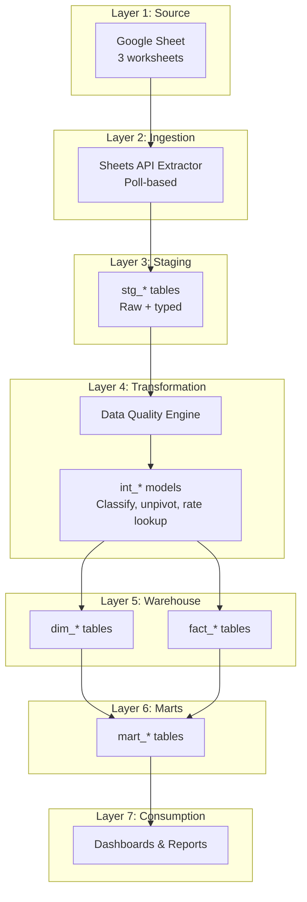
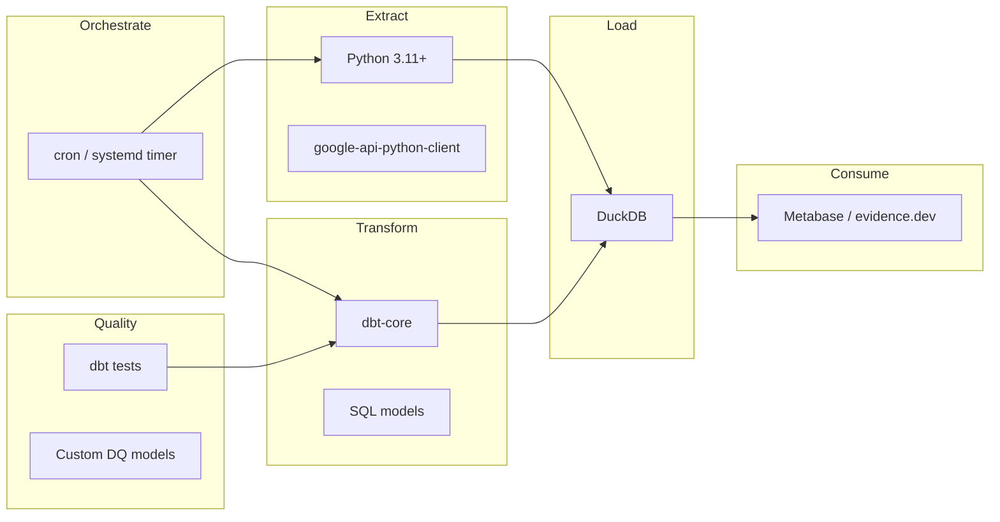
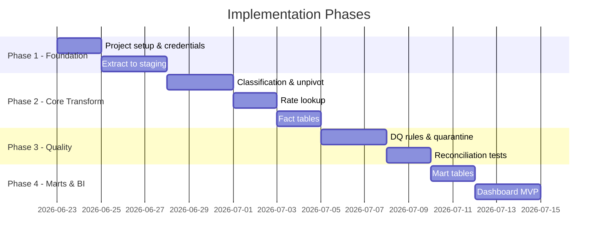

# Vegan Basket — Architecture Decisions

> **Status:** Draft — source of truth for ETL implementation
> **Last updated:** 2026-06-20
> **Format:** Architecture Decision Records (ADRs)

---

## 1. System Context

```mermaid
C4Context
    title Vegan Basket ETL — System Context

    Person(operator, "Business Operator", "Submits transactions via Google Form")
    Person(analyst, "Business Analyst", "Views reports and dashboards")

    System_Ext(gform, "Google Form", "Data entry UI")
    System_Ext(gsheet, "Google Sheet", "Operational data store")
    System(etl, "Vegan Basket Analytics", "Extract, transform, load pipeline")
    System_Ext(warehouse, "Analytics Warehouse", "DuckDB / BigQuery / PostgreSQL")
    System_Ext(bi, "BI Tool", "Metabase / Looker / Sheets dashboard")

    operator --> gform
    gform --> gsheet
    etl --> gsheet : "Google Sheets API"
    etl --> warehouse : "Load facts & dims"
    warehouse --> bi
    analyst --> bi
```

---

## 2. Architecture Overview



---

## 3. Decision Records

### ADR-001: Google Sheet as System of Record

| Field | Value |
|---|---|
| **Status** | Accepted |
| **Context** | Business already uses Google Form → Google Sheet for daily operations |
| **Decision** | Google Sheet remains the operational system of record; ETL reads via API |
| **Rationale** | Zero migration cost; operators keep existing workflow |
| **Consequences** | No transactional guarantees; schema evolution is manual; API rate limits apply |
| **Alternatives rejected** | Direct database entry app; Airtable; custom CRUD app |

---

### ADR-002: Medallion Architecture (Staging → Intermediate → Marts)

| Field | Value |
|---|---|
| **Status** | Accepted |
| **Context** | Need clear separation between raw ingestion and business logic |
| **Decision** | Three-layer medallion: Bronze (staging), Silver (intermediate + dims/facts), Gold (marts) |
| **Rationale** | Industry standard; supports debugging, DQ at each layer, and incremental evolution |
| **Consequences** | More tables to manage; acceptable given low volume |
| **Alternatives rejected** | Direct source-to-mart transforms; single flat table |

---

### ADR-003: Row Splitting for Multi-Event Transactions

| Field | Value |
|---|---|
| **Status** | Accepted |
| **Context** | Single form row can represent inventory + payment simultaneously |
| **Decision** | Classify each row into 0–2 event types; produce separate fact records per event type |
| **Rationale** | Aligns with business rules; enables clean AR/AP and inventory tracking |
| **Consequences** | 1:N row multiplication; requires `source_row_id` for traceability |
| **Alternatives rejected** | Store combined events in single wide fact table |

---

### ADR-004: Product Unpivot (Wide → Long)

| Field | Value |
|---|---|
| **Status** | Accepted |
| **Context** | Transaction Log has five product quantity columns |
| **Decision** | Unpivot to one row per product per transaction in `int_unpivoted_products` |
| **Rationale** | Normalized fact table; supports product-level metrics and rate lookup per product |
| **Consequences** | Up to 5× row multiplication for multi-product transactions |
| **Alternatives rejected** | Keep wide format in fact table; JSON array column |

---

### ADR-005: Effective-Dated Rate Lookup (Not SCD Type 2)

| Field | Value |
|---|---|
| **Status** | Accepted |
| **Context** | Vendor and customer rates change over time with `effective_from` dates |
| **Decision** | Point-in-time rate lookup at transform time from `stg_vendor_rates` / `stg_customer_rates`; do **not** build separate SCD Type 2 rate dimensions in the warehouse |
| **Rationale** | Low volume; rate history is already captured as multiple `(effective_from, counterparty)` rows in staging refreshed each run; point-in-time lookup matches business rules; avoids duplicate historization logic |
| **Consequences** | Rate history lives in staging tables; facts store the matched rate at transform time; retroactive sheet corrections do not re-value already-processed facts |
| **Alternatives rejected** | SCD Type 2 `dim_vendor_rate` / `dim_customer_rate` with effective/expiry columns |
| **Resolved** | Retroactive rate sheet changes do **not** re-process historical facts (forward-only by `transaction_date`) |

---

### ADR-006: Rate-Derived Valuation (Not Payment-Based)

| Field | Value |
|---|---|
| **Status** | Accepted |
| **Context** | Payment amount on a row may not equal qty × rate (partial payments, credit) |
| **Decision** | `line_value_rs = quantity × rate` for inventory; Payment tracked separately in `fact_payment` |
| **Rationale** | Separates goods movement value from cash movement; enables AR/AP |
| **Consequences** | Revenue ≠ cash received in period; requires both facts for full picture |
| **Alternatives rejected** | Use Payment field as line value when both qty and payment present |

---

### ADR-007: Derived Counterparty Dimensions (No Master Sheet)

| Field | Value |
|---|---|
| **Status** | Accepted |
| **Context** | No separate vendor/customer master in source |
| **Decision** | Build `dim_vendor` and `dim_customer` from distinct names in transactions + rates |
| **Rationale** | Matches current data reality; avoids master data management overhead |
| **Consequences** | Name typos create duplicate dimension members; requires DQ monitoring |
| **Alternatives rejected** | Separate master data sheet; manual MDM process |
| **Mitigation** | Case-insensitive matching; DQ warnings for similar names (future) |

---

### ADR-008: Analytics Warehouse — DuckDB (Default)

| Field | Value |
|---|---|
| **Status** | Proposed |
| **Context** | Small data volume; single analyst user; local development |
| **Decision** | Default to DuckDB for warehouse; abstract SQL for portability |
| **Rationale** | Zero infrastructure; fast local analytics; file-based |
| **Consequences** | Not multi-user concurrent; migration path needed if scale grows |
| **Alternatives** | BigQuery (GCP alignment with Google Sheets); PostgreSQL; SQLite |

> **Open question:** Confirm target warehouse with stakeholders.

---

### ADR-009: Transformation Framework — dbt (Recommended)

| Field | Value |
|---|---|
| **Status** | Proposed |
| **Context** | Need versioned, testable SQL transformations |
| **Decision** | Use dbt for staging → marts transformations |
| **Rationale** | SQL-based; built-in testing; documents lineage; supports DuckDB adapter |
| **Consequences** | Requires Python/dbt setup; team needs dbt familiarity |
| **Alternatives** | Pure Python (pandas); Apache Airflow SQL operators; custom scripts |

---

### ADR-010: Orchestration — Scheduled Script (MVP)

| Field | Value |
|---|---|
| **Status** | Proposed |
| **Context** | Low-frequency data entry; no real-time requirement |
| **Decision** | MVP: cron-scheduled Python script (extract) + dbt run (transform) |
| **Rationale** | Simplest viable orchestration; upgrade path to Airflow/Prefect later |
| **Consequences** | No retry UI; manual monitoring initially |
| **Alternatives** | Google Apps Script trigger; Airflow; Prefect; Dagster |

> **Open question:** Required refresh frequency?

---

### ADR-011: Ingestion — Google Sheets API v4

| Field | Value |
|---|---|
| **Status** | Accepted |
| **Context** | Need programmatic read access to Google Sheet |
| **Decision** | Use Google Sheets API v4 with service account authentication |
| **Rationale** | Official API; supports structured reads; service account for unattended runs |
| **Consequences** | Sheet must be shared with service account; credentials management required |
| **Alternatives** | CSV export; Google Apps Script; third-party connectors (Fivetran, Airbyte) |

---

### ADR-012: Stable Source Row Identity

| Field | Value |
|---|---|
| **Status** | Accepted (updated 2026-06-21) |
| **Context** | Re-runs must not duplicate facts; Google Sheet row numbers shift on insert/delete |
| **Decision** | `source_row_id = {sheet_id}:{tab}:{content_fingerprint[:16]}` where fingerprint = SHA-256 of normalized business columns |
| **Rationale** | Stable across row-number changes; Forms `Timestamp` distinguishes legitimate submissions; traceable to source content |
| **Consequences** | Content edits produce a new ID (old row soft-deleted); `source_row_number` stored for audit only |
| **Mitigation** | Identical-content collisions in one load disambiguated with `:row{source_row_number}` suffix |
| **See also** | [deletion_and_retention.md](./deletion_and_retention.md) |

---

### ADR-016: Source Deletion via Snapshot Diff + Soft Delete

| Field | Value |
|---|---|
| **Status** | Accepted |
| **Context** | Operators can delete rows from Google Sheets; no native CDC |
| **Decision** | Daily full read → compare `source_row_id` set vs previous load → soft-delete missing rows in staging and facts |
| **Rationale** | Low volume (< 10k rows); full refresh already planned; preserves audit trail; supports reactivation |
| **Consequences** | All staging/facts carry lifecycle columns; marts filter `is_deleted = false`; `etl_source_snapshot` table per load |
| **Alternatives rejected** | Hard delete; ignore deletions; row-number diff only |
| **See also** | [deletion_and_retention.md](./deletion_and_retention.md) |

---

### ADR-013: Quarantine over Silent Failure

| Field | Value |
|---|---|
| **Status** | Accepted |
| **Context** | Bad data must not corrupt analytics |
| **Decision** | DQ errors quarantine rows; warnings flag but load |
| **Rationale** | Fail-safe; operator can fix source and re-ingest |
| **Consequences** | Quarantine table needs periodic review |
| **Alternatives** | Silent NULL; hard pipeline failure on any error |

---

### ADR-014: Timezone — IST (Asia/Kolkata)

| Field | Value |
|---|---|
| **Status** | Proposed |
| **Context** | Indian business; "today" in form context |
| **Decision** | All date resolution and reporting in IST |
| **Rationale** | Matches business operating timezone |
| **Consequences** | Store UTC in warehouse; convert on display |
| **Open question** | Confirm with stakeholders |

---

### ADR-015: No Inventory Costing Method (MVP)

| Field | Value |
|---|---|
| **Status** | Accepted (MVP scope) |
| **Context** | Gross profit calculation needs inventory costing for accuracy |
| **Decision** | MVP uses simple period totals (total sales − total purchases); no FIFO/LIFO/WAC |
| **Rationale** | Sufficient for initial operational reporting |
| **Consequences** | Product-level profit may be inaccurate if inventory spans periods |
| **Future** | Implement weighted average cost when needed |

---

## 4. Technology Stack (Proposed)



| Component | Choice | Version | Notes |
|---|---|---|---|
| Language | Python | 3.11+ | Extract scripts |
| Transform | dbt | 1.7+ | SQL models + tests |
| Warehouse | DuckDB | 0.10+ | File-based; portable |
| Sheets API | google-api-python-client | latest | Service account auth |
| Orchestration | cron | — | MVP; upgrade later |
| BI | TBD | — | Metabase or evidence.dev recommended |
| Version control | Git | — | This repository |
| Secrets | .env / environment vars | — | Service account JSON path |

---

## 5. Security Considerations

| Area | Approach |
|---|---|
| Google credentials | Service account JSON; never committed to repo |
| Sheet access | Read-only service account permission |
| Warehouse | Local file or access-controlled cloud instance |
| PII | Vendor/customer names only; no personal data expected |
| Secrets management | `.env` file (local); environment variables (CI/CD) |

---

## 6. Non-Functional Requirements

| Requirement | Target | Notes |
|---|---|---|
| Data freshness | ≤ 24 hours | Pending confirmation |
| Pipeline runtime | < 5 minutes | Low volume assumption |
| Availability | Best effort | No SLA for MVP |
| Retention | Indefinite | All historical data preserved |
| Recovery | Re-run pipeline | Idempotent by design |
| Concurrency | Single user | DuckDB limitation |

---

## 7. Project Structure (Proposed)

```
vegan-basket-analytics/
├── docs/                          # This documentation (source of truth)
├── pipelines/                     # Python ingestion & orchestration (dlt)
├── dbt/                           # dbt project (staging → marts)
├── rill/                          # Rill dashboard project
├── tests/                         # Pytest suite
├── scripts/                       # Setup and utility scripts
├── data/                          # Local DuckDB (gitignored)
├── .github/workflows/             # CI
├── docker-compose.yml
├── .env.example
├── pyproject.toml
├── Makefile
└── README.md
```

---

## 8. Implementation Phases



| Phase | Deliverable | Exit Criteria |
|---|---|---|
| **1 — Foundation** | Extract + staging | 3 staging tables populated from live sheet |
| **2 — Core Transform** | Classification, rate lookup, facts | All 14 DQ test scenarios pass |
| **3 — Quality** | Validation mart, reconciliation | Warning rate visible; pipeline non-blocking |
| **4 — Marts & BI** | Mart tables, dashboard | Stakeholder sign-off on metrics |

---

## 9. Risks & Mitigations

| Risk | Impact | Likelihood | Mitigation |
|---|---|---|---|
| Name typos create duplicate vendors/customers | Medium | High | DQ fuzzy matching; periodic cleanup |
| Rate missing for transaction | High | Medium | Quarantine + alert; pre-validate rates exist |
| Google Sheet schema change | High | Low | Schema contract tests on ingest; version header row |
| Row insertion breaks `source_row_id` | Medium | Medium | Content-hash fallback key |
| Retroactive rate correction | Medium | Medium | Document re-processing procedure |
| Service account access revoked | High | Low | Monitoring on ingest failure |
| Negative inventory (oversell) | Medium | Medium | DQ warning; business rule clarification |

---

## 10. Assumptions

| # | Assumption |
|---|---|
| AR1 | Single business entity; no multi-entity consolidation |
| AR2 | One Google Sheet is the only data source |
| AR3 | All operators use the same Google Form |
| AR4 | Data volume remains < 50,000 rows/year |
| AR5 | No multi-currency; all amounts in INR |
| AR6 | No tax/GST tracking required in MVP |
| AR7 | No lot/batch tracking for products |
| AR8 | Implementation team has Python and SQL skills |
| AR9 | Sheet will be shared with service account for API access |

---

## 11. Open Questions

> **These require stakeholder clarification before implementation begins.**

### Business Logic

| # | Question | Impact | Default if Unanswered |
|---|---|---|---|
| OQ-01 | Is "Pannet" the correct product name (vs Punnet)? | Naming, reporting | Use "Pannet" as in source |
| OQ-02 | Can quantities or payments be negative (refunds/adjustments)? | DQ rules, fact design | Quantities rejected; negative payments allowed as refunds (`warning`) |
| OQ-03 | Can inventory go negative (oversell allowed)? | Inventory metrics | Flag warning; allow |
| OQ-04 | Are mushroom grades fungible or strictly separate? | Inventory tracking | Strictly separate |
| OQ-05 | When row has inventory + payment, is payment against that transaction or general settlement? | AR/AP accuracy | General settlement |
| OQ-06 | Can Transaction Date be in the future? | Rate lookup, DQ | Reject future dates |
| OQ-07 | If rate is missing, reject row or load with zero/null value? | DQ severity, metrics | Quarantine (reject) |
| OQ-08 | If rate row has blank product rate, inherit previous rate or error? | Rate lookup | Error (missing_rate) |
| OQ-09 | Retroactive rate sheet changes — re-process historical facts? | ADR-005, pipeline design | No (forward-only) |
| OQ-10 | Is Payment Mode required when Payment = 0? | DQ rules | Not required |

### Data Entry

| # | Question | Impact | Default if Unanswered |
|---|---|---|---|
| OQ-11 | Are vendor/customer names free text or dropdown? | DQ, dedup | Free text |
| OQ-12 | Can both Vendor Name and Customer Name be filled on one row? | Classification | Flag `warning`; load row; use `transaction_type` for counterparty |
| OQ-13 | How are duplicate form submissions handled? | Dedup strategy | Flag warning; load both |
| OQ-14 | Are rows ever deleted from the sheet? | Incremental strategy | Yes — detect via snapshot diff; soft-delete in warehouse |
| OQ-15 | Exact sheet tab names (case-sensitive)? | API extraction | As documented |
| OQ-16 | Are there existing rows with known data quality issues? | Initial load strategy | Quarantine incrementally |

### Technical

| # | Question | Impact | Default if Unanswered |
|---|---|---|---|
| OQ-17 | Target analytics warehouse (DuckDB / BigQuery / PostgreSQL)? | Infrastructure | DuckDB |
| OQ-18 | Required data refresh frequency? | Orchestration | Daily |
| OQ-19 | BI tool preference? | Phase 4 | Metabase |
| OQ-20 | Who manages Google service account credentials? | Security | Developer |
| OQ-21 | Fiscal year for reporting (calendar / custom)? | Mart design | Calendar year (Apr-Mar Indian FY?) |
| OQ-22 | Timezone confirmation (IST)? | Date resolution | IST |
| OQ-23 | Inventory valuation method for on-hand value? | Metrics | Latest purchase rate |
| OQ-24 | Is AR aging / DSO reporting needed in MVP? | Mart scope | Defer to Phase 4+ |
| OQ-25 | GST/tax tracking needed? | Schema scope | Not in MVP |

### Operational

| # | Question | Impact | Default if Unanswered |
|---|---|---|---|
| OQ-26 | Who reviews quarantined rows? | Operations | Business operator |
| OQ-27 | Alert channel for DQ failures (email/Slack)? | Monitoring | Email |
| OQ-28 | Acceptable DQ error rate for go-live? | Quality gate | < 5% |
| OQ-29 | Is historical data backfill required? If so, from what date? | Initial load | All existing rows |
| OQ-30 | Multiple operators / locations in future? | Schema extensibility | Single operator for MVP |

---

## 12. Decision Log

| Date | ADR | Change | Author |
|---|---|---|---|
| 2026-06-20 | All | Initial draft | Analytics Engineering |
| 2026-06-21 | ADR-012, ADR-016 | Content-based source_row_id; snapshot diff soft-delete for source row removal | Analytics Engineering |

---

## 13. References

- [business_rules.md](./business_rules.md)
- [data_dictionary.md](./data_dictionary.md)
- [metric_definitions.md](./metric_definitions.md)
- [data_quality_rules.md](./data_quality_rules.md)
- [source_to_target_mapping.md](./source_to_target_mapping.md)
- [deletion_and_retention.md](./deletion_and_retention.md)
- Google Sheet: `https://docs.google.com/spreadsheets/d/1hY17FV_LLYVDLe1zKAaVVV4GkyIrZ1GXMbeeL65mLRI/edit`
