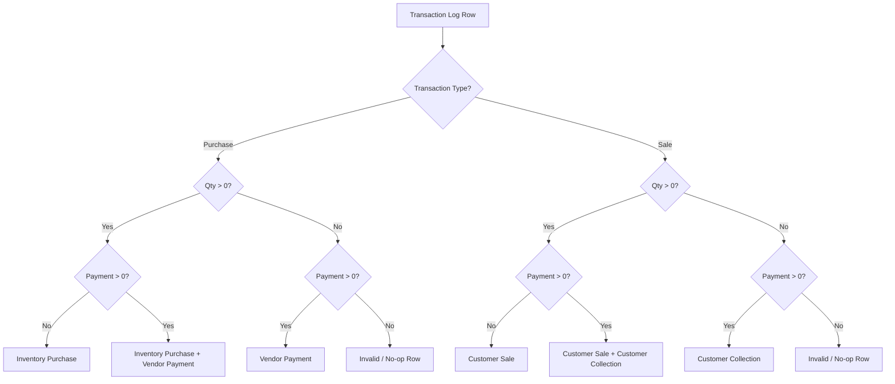
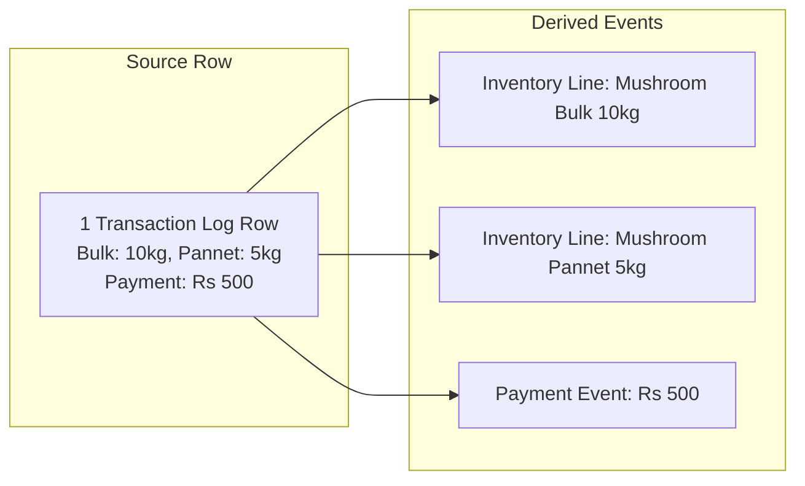
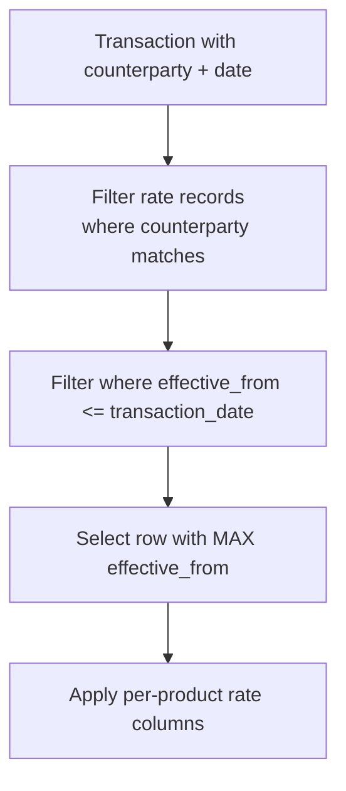
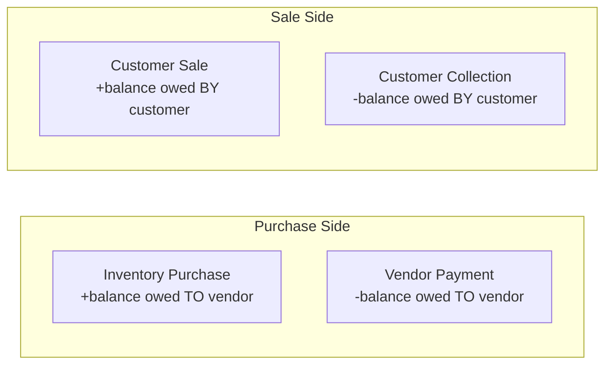

# Vegan Basket — Business Rules

> **Status:** Draft — source of truth for ETL implementation
> **Last updated:** 2026-06-20
> **Source system:** Google Form → Google Sheet
> **Sheet ID:** `1hY17FV_LLYVDLe1zKAaVVV4GkyIrZ1GXMbeeL65mLRI`

---

## 1. Business Overview

Vegan Basket is an agricultural trading business that buys produce from **vendors** and sells to **customers**. Operational data is captured via a Google Form and stored in a Google Sheet with three worksheets.

### 1.1 Products

| Product Code | Display Name | Unit |
|---|---|---|
| `mushroom_bulk` | Mushroom Bulk | kg |
| `mushroom_pannet` | Mushroom Pannet | kg |
| `mushroom_b_grade` | Mushroom B Grade | kg |
| `baby_corn` | Baby Corn | kg |
| `lahsun` | Lahsun | kg |

> **Assumption:** All quantity fields are measured in kilograms (kg). Currency is Indian Rupees (Rs).

### 1.2 Transaction Types

| Type | Direction | Counterparty Field |
|---|---|---|
| `Purchase` | Inbound (inventory in) | Vendor Name |
| `Sale` | Outbound (inventory out) | Customer Name |

### 1.3 Payment Modes

| Mode | Description |
|---|---|
| `Cash` | Physical cash exchange |
| `Online` | Digital transfer (UPI, bank transfer, etc.) |

---

## 2. Transaction Classification Rules

Each row in the **Transaction Log** represents a single form submission. A row may represent one or two **business events** depending on quantity and payment values.

### 2.1 Classification Matrix



### 2.2 Purchase Rules

| Condition | Business Event(s) | Description |
|---|---|---|
| Qty > 0, Payment = 0 | **Inventory Purchase** | Goods received; amount owed to vendor (credit purchase) |
| Qty = 0, Payment > 0 | **Vendor Payment** | Payment to vendor with no goods movement (settling outstanding balance) |
| Qty > 0, Payment > 0 | **Inventory Purchase** + **Vendor Payment** | Goods received and partial/full payment made in same entry |
| Qty = 0, Payment < 0 | **Vendor Payment Refund** | Refund or adjustment to vendor (no goods movement); DQ `warning` |
| Qty > 0, Payment < 0 | **Inventory Purchase** + **Vendor Payment Refund** | Goods received with refund/adjustment in same entry; DQ `warning` |
| Qty = 0, Payment = 0 | **Invalid** | No business activity — flag for data quality review |

**Payment event trigger:** A payment/collection event is created when `payment_rs != 0` (positive payments/collections or negative refunds/adjustments).

**Payment semantics (Purchase):** `Payment (Rs)` = amount **paid to** the vendor in this transaction (negative = refund to vendor).

### 2.3 Sale Rules

| Condition | Business Event(s) | Description |
|---|---|---|
| Qty > 0, Payment = 0 | **Customer Sale** | Goods delivered; amount owed by customer (credit sale) |
| Qty = 0, Payment > 0 | **Customer Collection** | Payment received from customer with no goods movement |
| Qty > 0, Payment > 0 | **Customer Sale** + **Customer Collection** | Goods delivered and partial/full payment received in same entry |
| Qty = 0, Payment < 0 | **Customer Collection Refund** | Refund or adjustment to customer (no goods movement); DQ `warning` |
| Qty > 0, Payment < 0 | **Customer Sale** + **Customer Collection Refund** | Goods delivered with refund/adjustment in same entry; DQ `warning` |
| Qty = 0, Payment = 0 | **Invalid** | No business activity — flag for data quality review |

**Payment semantics (Sale):** `Payment (Rs)` = amount **received from** the customer in this transaction (negative = refund to customer).

### 2.4 Quantity Aggregation Rule

**Qty** for classification purposes is the **sum of all product quantity columns** on the row:

```
total_qty = Mushroom Bulk Qty
          + Mushroom Pannet Qty
          + Mushroom B Grade Qty
          + Baby Corn Qty
          + Lahsun Qty
```

> **Assumption:** A row is classified as having inventory movement if `total_qty > 0`, regardless of which individual products have quantity.

> **Open question:** Should classification use per-product logic instead (e.g., payment-only row with zero total qty but this seems covered)?
> **Answer:** Above assumption is correct.

---

## 3. Multi-Product Line Item Rules

When a row has `total_qty > 0`, inventory events are created **per product column** where that product's quantity > 0.



| Rule | Detail |
|---|---|
| Line item granularity | One inventory line per product with qty > 0 |
| Payment allocation | Payment is **not** split across product lines at source; it applies to the counterparty as a single amount |
| Zero-qty products | Product columns with qty = 0 or blank are ignored |

---

## 4. Rate Lookup Rules

### 4.1 Rate Source

| Transaction Type | Rate Sheet | Match Key |
|---|---|---|
| Purchase | Vendor Rates | Vendor Name |
| Sale | Customer Rates | Customer Name |

### 4.2 Rate Selection Logic



| Rule | Detail |
|---|---|
| Effective date filter | `effective_from <= transaction_date` |
| Tie-breaker | Latest `effective_from` wins (maximum date on or before transaction date) |
| Future rates | Rates with `effective_from > transaction_date` are **excluded** |
| Retroactive changes | Rate changes only affect **future** transactions (by transaction date) |
| Per-product rates | Each product column has its own rate; apply independently per line item |

### 4.3 Valuation

For each inventory line item:

```
line_value = product_qty × applicable_rate
```

| Event Type | Value Meaning |
|---|---|
| Inventory Purchase | Cost of goods acquired (COGS input) |
| Customer Sale | Revenue |

> **Assumption:** When payment and inventory occur in the same row, `line_value` is computed from rates independently of the `Payment` field. Payment is tracked separately as a cash/AP/AR event.

> **Open question:** If no matching rate exists, should the row be rejected, flagged, or valued at zero?
> **Answer:** Flag the row and the missing rate.

---

## 5. Counterparty Rules

### 5.1 Vendor vs Customer

| Transaction Type | Required Field | Must Be Empty |
|---|---|---|
| Purchase | Vendor Name | Customer Name |
| Sale | Customer Name | Vendor Name |

> **Assumption:** Each row pertains to exactly one counterparty. The inactive field should be blank.

> **Open question:** Are rows with both names populated valid? How should they be handled?
> **Answer:** Invalid input — flag as DQ `warning`, load the row, and use `transaction_type` to determine the active counterparty (`Purchase` → vendor; `Sale` → customer).

### 5.2 Counterparty Master Data

Vendors and customers are **derived** from distinct values appearing in Transaction Log and Rates sheets. There is no separate master sheet.

| Entity | Source of Truth for Existence | Source of Truth for Rates |
|---|---|---|
| Vendor | Vendor Name in Transaction Log + Vendor Rates | Vendor Rates sheet |
| Customer | Customer Name in Transaction Log + Customer Rates | Customer Rates sheet |

---

## 6. Date Rules

| Field | Meaning | Usage |
|---|---|---|
| `Timestamp` | Form submission datetime (system-generated) | Audit trail, ingestion watermark |
| `Transaction Date` | Business date of the transaction | Rate lookup, financial reporting, inventory dating |

### 6.1 Transaction Date Resolution

```
IF Transaction Date is blank OR equals today (submission date):
    transaction_date = DATE(Timestamp)
ELSE:
    transaction_date = Transaction Date
```

> **Assumption:** "If not same as today" means the form pre-fills today's date and users change it only for backdated entries.

> **Open question:** What timezone applies to `Timestamp` and "today"? (Assumed: IST / Asia/Kolkata)
> **Answer:** IST / Asia/Kolkata

> **Open question:** Can `Transaction Date` be in the future? If so, how should rates be applied?
> **Answer:** No, the transaction date should not be in the future.

---

## 7. Payment Mode Rules

| Condition | Payment Mode |
|---|---|
| Payment = 0 | Not required; may be blank |
| Payment ≠ 0 | Must resolve to `Cash` or `Online`; if blank at source, **default to `Cash`** in staging (DQ `warning`) |

> **Open question:** Is Payment Mode required when Payment > 0? What is the default if blank?
> **Answer:** When `payment_rs != 0`, payment mode must be `Cash` or `Online`. If blank at source, staging defaults to `Cash` and records a DQ `warning` (row is not quarantined).

---

## 8. Accounts Receivable / Payable Logic

Derived balances are computed from classified events (not stored in source).

### 8.1 Vendor (Accounts Payable)

```
vendor_balance = SUM(inventory_purchase_value) - SUM(vendor_payments)
```

Per vendor, cumulative from beginning of time through reporting date.

### 8.2 Customer (Accounts Receivable)

```
customer_balance = SUM(customer_sale_value) - SUM(customer_collections)
```

Per customer, cumulative from beginning of time through reporting date.



> **Assumption:** Balances are computed from rate-derived values, not from Payment field on purchase/sale rows (except where Payment represents settlement).

> **Open question:** When a row has both inventory and payment, is Payment always treated as settlement against total outstanding, or against that specific transaction's value?
> **Answer:** Payment is always treated as settlement against total outstanding.

---

## 9. Inventory Rules

### 9.1 Inventory Movement

| Event | Inventory Effect |
|---|---|
| Inventory Purchase | +qty per product |
| Customer Sale | −qty per product |

### 9.2 Inventory Balance

```
inventory_on_hand[product] = SUM(purchase_qty) - SUM(sale_qty)
```

> **Assumption:** Single warehouse / no location dimension.

> **Open question:** Can inventory go negative? If so, is that a data error or valid (oversell)?
> **Answer:** No, inventory cannot go negative.

> **Open question:** Is Mushroom B Grade tracked as separate inventory from Mushroom Bulk, or are they fungible?
> **Answer:** Mushroom B Grade is tracked as separate inventory from Mushroom Bulk.

---

## 10. Remarks Field

Free-text optional field on all sheets. Used for operational notes only.

| Rule | Detail |
|---|---|
| Parsing | Not parsed for business logic |
| Storage | Preserved as-is in staging and detail tables |
| Search | Available for audit / troubleshooting |

---

## 11. Assumptions Summary

| # | Assumption |
|---|---|
| A1 | All quantities are in kg; all monetary amounts are in Rs (INR) |
| A2 | `total_qty` is the sum of all five product columns for classification |
| A3 | One inventory line item per product with qty > 0 per source row |
| A4 | Payment is not allocated across product lines at the source level |
| A5 | Rate lookup uses `transaction_date`, not `Timestamp` |
| A6 | Latest applicable rate (max `effective_from` ≤ transaction date) applies |
| A7 | Vendors and customers are inferred from data; no separate master sheet |
| A8 | Purchase rows use Vendor Name; Sale rows use Customer Name |
| A9 | Timezone for date resolution is IST (Asia/Kolkata) unless specified otherwise |
| A10 | Single inventory pool per product; no multi-location tracking |
| A11 | Remarks are informational only |
| A12 | Google Sheet column headers match the field names documented in `data_dictionary.md` exactly |

---

## 12. Open Questions

See consolidated list in [architecture_decisions.md](./architecture_decisions.md#open-questions). Key business rule ambiguities:

1. **Missing rate:** Reject, flag, or zero-value?
> **Answer:** Flag the row and the missing rate.
2. **Both vendor and customer populated:** Valid or error?
> **Answer:** Invalid input — DQ `warning`; load row; use `transaction_type` for counterparty.
3. **Negative quantities:** Allowed?
> **Answer:** No, quantities cannot be negative.
4. **Negative payments:** Allowed (refunds/adjustments)?
> **Answer:** Yes — allowed as refunds/adjustments with DQ `warning`; payment events created when `payment_rs != 0`.
5. **Future transaction dates:** Allowed? Rate behavior?
> **Answer:** No, the transaction date should not be in the future.
6. **Payment-in-same-row:** Settlement against what balance?
> **Answer:** Payment is always treated as settlement against total outstanding.
7. **Negative inventory:** Error or allowed?
> **Answer:** No, inventory cannot go negative.
8. **Product fungibility:** Are mushroom grades interchangeable?
> **Answer:** Mushroom B Grade is tracked as separate inventory from Mushroom Bulk.
9. **"Pannet" spelling:** Confirm intended name (Punnet?).
> **Answer:** Yes, "Pannet" is the correct spelling.
10. **Payment Mode when Payment = 0:** Must it be blank?
> **Answer:** Not required when `payment_rs = 0`. When `payment_rs != 0`, blank source values default to `Cash` with DQ `warning`.
11. **Partial rate rows:** If a rate row has blank product rate, inherit previous or error?
> **Answer:** Error (missing_rate)
12. **Duplicate form submissions:** Deduplication strategy?
> **Answer:** Flag duplicate submissions as DQ `warning` and **load both** rows (no automatic deduplication).
13. **Backdated rate entries:** If a new rate is inserted with past effective_from, does it retroactively affect already-processed transactions?
> **Answer:** No, the new rate should not retroactively affect already-processed transactions.
