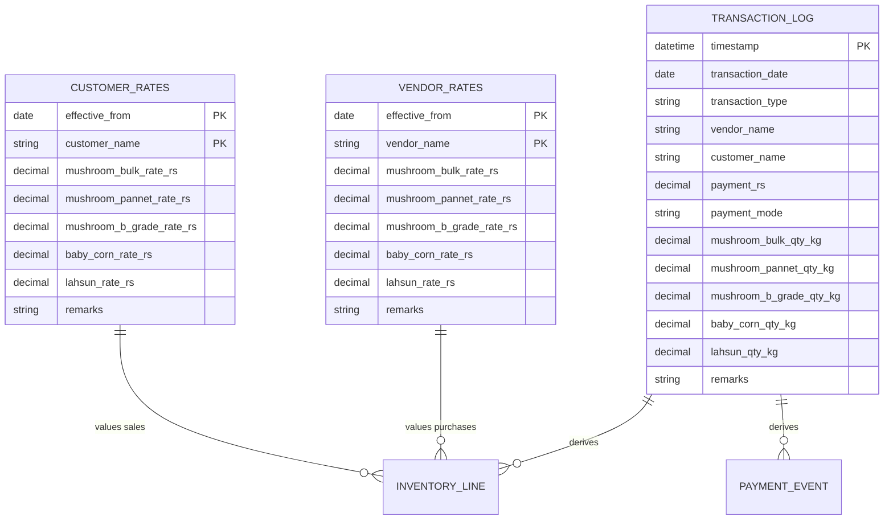
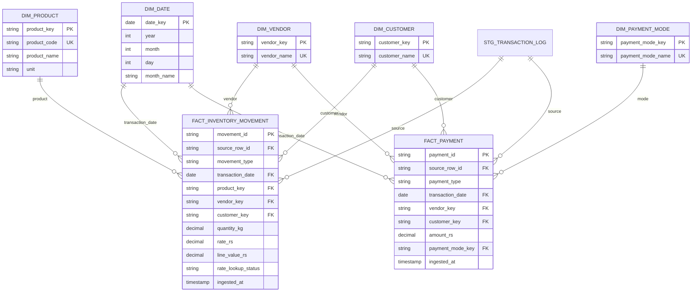

# Vegan Basket — Data Dictionary

> **Status:** Draft — source of truth for ETL implementation
> **Last updated:** 2026-06-20
> **Source:** Google Sheet `1hY17FV_LLYVDLe1zKAaVVV4GkyIrZ1GXMbeeL65mLRI`

---

## 1. Source System Overview

---

## 2. Source Tables

### 2.1 `transaction_log` (Sheet: Transaction Log)

Raw operational entries from Google Form submissions.

| # | Source Column Name | Target Field | Data Type | Required | Default | Description |
|---|---|---|---|---|---|---|
| 1 | Timestamp | `timestamp` | `TIMESTAMP` | Yes | — | Form submission datetime (Google Forms auto-capture) |
| 2 | Transaction Date (if not same as today) | `transaction_date` | `DATE` | No | `DATE(timestamp)` | Business date; blank or today → use submission date |
| 3 | Transaction Type | `transaction_type` | `STRING` | Yes | — | `Purchase` or `Sale` |
| 4 | Vendor Name | `vendor_name` | `STRING` | Conditional | — | Required for Purchase; blank for Sale |
| 5 | Customer Name | `customer_name` | `STRING` | Conditional | — | Required for Sale; blank for Purchase |
| 6 | Payment (Rs) | `payment_rs` | `DECIMAL(12,2)` | No | `0` | Amount paid (Purchase) or received (Sale) |
| 7 | Payment Mode | `payment_mode` | `STRING` | Conditional | `Cash` when `payment_rs != 0` and source blank | `Cash` or `Online`; blank at source defaults to `Cash` in staging |
| 8 | Mushroom Bulk Qty (kg) | `mushroom_bulk_qty_kg` | `DECIMAL(10,3)` | No | `0` | Quantity in kg |
| 9 | Mushroom Pannet Qty (kg) | `mushroom_pannet_qty_kg` | `DECIMAL(10,3)` | No | `0` | Quantity in kg |
| 10 | Mushroom B Grade Qty (kg) | `mushroom_b_grade_qty_kg` | `DECIMAL(10,3)` | No | `0` | Quantity in kg |
| 11 | Baby Corn Qty (kg) | `baby_corn_qty_kg` | `DECIMAL(10,3)` | No | `0` | Quantity in kg |
| 12 | Lahsun Qty (kg) | `lahsun_qty_kg` | `DECIMAL(10,3)` | No | `0` | Quantity in kg |
| 13 | Remarks | `remarks` | `STRING` | No | — | Free-text notes |

**Derived fields (not in source):**

| Field | Type | Formula / Logic |
|---|---|---|
| `total_qty_kg` | `DECIMAL(10,3)` | Sum of five product qty columns |
| `resolved_transaction_date` | `DATE` | See [business_rules.md §6.1](./business_rules.md#61-transaction-date-resolution) |
| `source_row_id` | `STRING` | Surrogate key: `{sheet_id}:{tab}:{content_fingerprint[:16]}` — see [deletion_and_retention.md](./deletion_and_retention.md) |
| `source_row_number` | `INTEGER` | Current sheet row number (audit only; not identity) |
| `business_event_types` | `ARRAY<STRING>` | Classified event(s) per classification matrix |

**Allowed values:**

| Field | Valid Values |
|---|---|
| `transaction_type` | `Purchase`, `Sale` |
| `payment_mode` | `Cash`, `Online`, `NULL` (blank defaults to `Cash` in staging when `payment_rs != 0`) |
| `payment_rs` | Any numeric value; negative values allowed as refunds/adjustments (DQ `warning`) |
| Product qty columns | `>= 0` |

---

### 2.2 `vendor_rates` (Sheet: Vendor Rates)

Purchase price list by vendor, effective-dated.

| # | Source Column Name | Target Field | Data Type | Required | Description |
|---|---|---|---|---|---|
| 1 | Effective From Date | `effective_from` | `DATE` | Yes | Date from which rates apply |
| 2 | Vendor Name | `vendor_name` | `STRING` | Yes | Vendor identifier |
| 3 | Mushroom Bulk Rate (Rs) | `mushroom_bulk_rate_rs` | `DECIMAL(10,2)` | No | Rate per kg |
| 4 | Mushroom Pannet Rate (Rs) | `mushroom_pannet_rate_rs` | `DECIMAL(10,2)` | No | Rate per kg |
| 5 | Mushroom B Grade Rate (Rs) | `mushroom_b_grade_rate_rs` | `DECIMAL(10,2)` | No | Rate per kg |
| 6 | Baby Corn Rate (Rs) | `baby_corn_rate_rs` | `DECIMAL(10,2)` | No | Rate per kg |
| 7 | Lahsun Rate (Rs) | `lahsun_rate_rs` | `DECIMAL(10,2)` | No | Rate per kg |
| 8 | Remarks | `remarks` | `STRING` | No | Free-text notes |

**Composite natural key:** `(effective_from, vendor_name)`

> **Assumption:** Multiple rows per vendor with different `effective_from` dates represent rate history.

> **Open question:** Can two rows share the same `(effective_from, vendor_name)`? If so, which wins?
> **Answer:** No, two rows cannot share the same `(effective_from, vendor_name)`.

---

### 2.3 `customer_rates` (Sheet: Customer Rates)

Sale price list by customer, effective-dated.

| # | Source Column Name | Target Field | Data Type | Required | Description |
|---|---|---|---|---|---|
| 1 | Effective From Date | `effective_from` | `DATE` | Yes | Date from which rates apply |
| 2 | Customer Name | `customer_name` | `STRING` | Yes | Customer identifier |
| 3 | Mushroom Bulk Rate (Rs) | `mushroom_bulk_rate_rs` | `DECIMAL(10,2)` | No | Rate per kg |
| 4 | Mushroom Pannet Rate (Rs) | `mushroom_pannet_rate_rs` | `DECIMAL(10,2)` | No | Rate per kg |
| 5 | Mushroom B Grade Rate (Rs) | `mushroom_b_grade_rate_rs` | `DECIMAL(10,2)` | No | Rate per kg |
| 6 | Baby Corn Rate (Rs) | `baby_corn_rate_rs` | `DECIMAL(10,2)` | No | Rate per kg |
| 7 | Lahsun Rate (Rs) | `lahsun_rate_rs` | `DECIMAL(10,2)` | No | Rate per kg |
| 8 | Remarks | `remarks` | `STRING` | No | Free-text notes |

**Composite natural key:** `(effective_from, customer_name)`

---

## 3. Target Data Model

### 3.1 Entity Relationship Diagram

---

### 3.2 Dimension Tables

#### `dim_product`

| Column | Type | Description |
|---|---|---|
| `product_key` | `STRING` | Surrogate PK |
| `product_code` | `STRING` | Stable code: `mushroom_bulk`, etc. |
| `product_name` | `STRING` | Display name from source column |
| `unit` | `STRING` | Always `kg` |

**Seed data:**

| product_code | product_name |
|---|---|
| `mushroom_bulk` | Mushroom Bulk |
| `mushroom_pannet` | Mushroom Pannet |
| `mushroom_b_grade` | Mushroom B Grade |
| `baby_corn` | Baby Corn |
| `lahsun` | Lahsun |

#### `dim_vendor`

| Column | Type | Description |
|---|---|---|
| `vendor_key` | `STRING` | Surrogate PK |
| `vendor_name` | `STRING` | Natural key; trimmed, case-normalized |

#### `dim_customer`

| Column | Type | Description |
|---|---|---|
| `customer_key` | `STRING` | Surrogate PK |
| `customer_name` | `STRING` | Natural key; trimmed, case-normalized |

#### `dim_date`

Standard date dimension generated from min/max transaction dates.

#### `dim_payment_mode`

| payment_mode_key | payment_mode_name |
|---|---|
| `cash` | Cash |
| `online` | Online |

---

### 3.3 Fact Tables

#### `fact_inventory_movement`

One row per product line item derived from Transaction Log.

| Column | Type | Nullable | Description |
|---|---|---|---|
| `movement_id` | `STRING` | No | Surrogate PK |
| `source_row_id` | `STRING` | No | FK to staging transaction row |
| `movement_type` | `STRING` | No | `inventory_purchase` or `customer_sale` |
| `transaction_date` | `DATE` | No | Resolved business date |
| `product_key` | `STRING` | No | FK to dim_product |
| `vendor_key` | `STRING` | Yes | FK; populated for purchases |
| `customer_key` | `STRING` | Yes | FK; populated for sales |
| `quantity_kg` | `DECIMAL(10,3)` | No | Product quantity |
| `rate_rs` | `DECIMAL(10,2)` | Yes | Looked-up rate per kg |
| `line_value_rs` | `DECIMAL(12,2)` | Yes | `quantity_kg × rate_rs` |
| `rate_lookup_status` | `STRING` | No | `matched`, `missing_rate`, `missing_counterparty` |
| `source_timestamp` | `TIMESTAMP` | No | Original form timestamp |
| `remarks` | `STRING` | Yes | From source row |
| `ingested_at` | `TIMESTAMP` | No | ETL load timestamp |
| `is_deleted` | `BOOLEAN` | No | Soft-delete flag; default `false` |
| `deleted_at` | `TIMESTAMP` | Yes | When row was soft-deleted |
| `deletion_reason` | `STRING` | Yes | e.g. `source_removed` |

#### `fact_payment`

One row per payment/collection event derived from Transaction Log.

| Column | Type | Nullable | Description |
|---|---|---|---|
| `payment_id` | `STRING` | No | Surrogate PK |
| `source_row_id` | `STRING` | No | FK to staging transaction row |
| `payment_type` | `STRING` | No | `vendor_payment` or `customer_collection` |
| `transaction_date` | `DATE` | No | Resolved business date |
| `vendor_key` | `STRING` | Yes | FK; populated for vendor payments |
| `customer_key` | `STRING` | Yes | FK; populated for customer collections |
| `amount_rs` | `DECIMAL(12,2)` | No | Payment amount |
| `payment_mode_key` | `STRING` | Yes | FK to dim_payment_mode |
| `source_timestamp` | `TIMESTAMP` | No | Original form timestamp |
| `remarks` | `STRING` | Yes | From source row |
| `ingested_at` | `TIMESTAMP` | No | ETL load timestamp |
| `is_deleted` | `BOOLEAN` | No | Soft-delete flag; default `false` |
| `deleted_at` | `TIMESTAMP` | Yes | When row was soft-deleted |
| `deletion_reason` | `STRING` | Yes | e.g. `source_removed` |

---

### 3.4 Staging Tables

#### `stg_transaction_log`

1:1 mirror of source Transaction Log with type casting, trimming, and derived fields. No business classification applied.

**Lifecycle columns (soft delete):** `is_deleted`, `deleted_at`, `deletion_reason`, `deleted_by_load_id`, `last_seen_load_id`, `last_seen_at`, `source_row_number` — see [deletion_and_retention.md](./deletion_and_retention.md).

#### `stg_vendor_rates`

1:1 mirror of source Vendor Rates with type casting and trimming. Includes the same lifecycle columns.

#### `stg_customer_rates`

1:1 mirror of source Customer Rates with type casting and trimming. Includes the same lifecycle columns.

#### `etl_source_snapshot`

Per-load audit of source rows observed during extraction.

| Column | Type | Description |
|---|---|---|
| `load_id` | `STRING` | Pipeline run ID |
| `sheet_tab` | `STRING` | Sheet tab name |
| `source_row_id` | `STRING` | Content-based row identity |
| `source_row_number` | `INTEGER` | Row number at extract time |
| `first_seen_at` | `TIMESTAMP` | First seen in this load record |
| `last_seen_at` | `TIMESTAMP` | Last seen in this load record |
| `is_present` | `BOOLEAN` | Row was in this load's extract |

#### `stg_rate_lookup` (intermediate)

| Column | Type | Description |
|---|---|---|
| `counterparty_type` | `STRING` | `vendor` or `customer` |
| `counterparty_name` | `STRING` | Name |
| `transaction_date` | `DATE` | Lookup date |
| `product_code` | `STRING` | Product |
| `effective_from` | `DATE` | Matched rate effective date |
| `rate_rs` | `DECIMAL(10,2)` | Matched rate |

---

### 3.5 Reference / Audit Tables

#### `dq_violations`

Data quality rule failures. See [data_quality_rules.md](./data_quality_rules.md).

| Column | Type | Description |
|---|---|---|
| `violation_id` | `STRING` | PK |
| `rule_id` | `STRING` | FK to DQ rule |
| `source_table` | `STRING` | Origin table |
| `source_row_id` | `STRING` | Row identifier |
| `severity` | `STRING` | `error`, `warning` |
| `details` | `STRING` | Human-readable description |
| `detected_at` | `TIMESTAMP` | When detected |

---

## 4. Naming Conventions

| Layer | Prefix | Example |
|---|---|---|
| Staging | `stg_` | `stg_transaction_log` |
| Dimension | `dim_` | `dim_product` |
| Fact | `fact_` | `fact_inventory_movement` |
| Intermediate | `int_` | `int_classified_transactions` |
| Mart | `mart_` | `mart_daily_sales` |

| Convention | Rule |
|---|---|
| Column names | `snake_case` |
| Primary keys | `{entity}_key` or `{entity}_id` |
| Foreign keys | `{referenced_entity}_key` |
| Monetary fields | Suffix `_rs` |
| Quantity fields | Suffix `_kg` |
| Dates | Suffix `_date` or `_at` for timestamps |

---

## 5. Data Types & Precision

| Domain | Type | Precision | Notes |
|---|---|---|---|
| Money (Rs) | `DECIMAL` | (12, 2) | Sufficient for daily trading volumes |
| Quantity (kg) | `DECIMAL` | (10, 3) | Sub-kg precision for partial kg |
| Names | `STRING` | — | Trimmed; max 255 chars assumed |
| Dates | `DATE` | — | ISO 8601 |
| Timestamps | `TIMESTAMP` | — | UTC storage; IST display |

---

## 6. Assumptions

| # | Assumption |
|---|---|
| D1 | Google Sheet row 1 contains column headers exactly as listed |
| D2 | No hidden columns or merged cells in source sheets |
| D3 | Google Forms enforces dropdown values for Transaction Type and Payment Mode |
| D4 | Blank numeric cells in source = 0 |
| D5 | `vendor_name` / `customer_name` matching is case-insensitive after trim |
| D6 | Surrogate keys are generated by ETL; not present in source |
| D7 | `source_row_id` = `{sheet_id}:{sheet_name}:{content_fingerprint[:16]}` — content-based, not row number |
| D8 | `source_row_number` is audit metadata only; row numbers may change when the sheet is edited |

---

## 7. Open Questions

1. Exact Google Forms validation rules (dropdown options, required fields)?
> **Answer:** The Google Forms validation rules are as follows:
> - Transaction Type: Required
> - Vendor Name: Required for Purchase, blank for Sale
> - Customer Name: Required for Sale, blank for Purchase
> - Payment (Rs): Optional
> - Payment Mode: Optional; when `payment_rs != 0`, blank values default to `Cash` in staging (DQ `warning`)
> - Mushroom Bulk Qty (kg): Optional
> - Mushroom Pannet Qty (kg): Optional
> - Mushroom B Grade Qty (kg): Optional
> - Baby Corn Qty (kg): Optional
> - Lahsun Qty (kg): Optional
> - Remarks: Optional
2. Are there header rows beyond row 1 (e.g., section headers)?
> **Answer:** No, there are no header rows beyond row 1.
3. Maximum expected row volume (affects key strategy)?
> **Answer:** The maximum expected row volume is 10,000 rows.
4. Are vendor/customer names standardized in the form (dropdown) or free text?
> **Answer:** Vendor/customer names are standardized in the form as dropdowns.
5. Confirm "Pannet" is the canonical product name.
> **Answer:** Yes.
6. Decimal separator in sheet — period or comma?
> **Answer:** Period.
7. Are there existing historical rows with data inconsistencies to preserve?
> **Answer:** No, there are no existing historical rows with data inconsistencies to preserve.
8. Are there duplicate submissions within 60 seconds?
> **Answer:** No, there are no duplicate submissions within 60 seconds.
