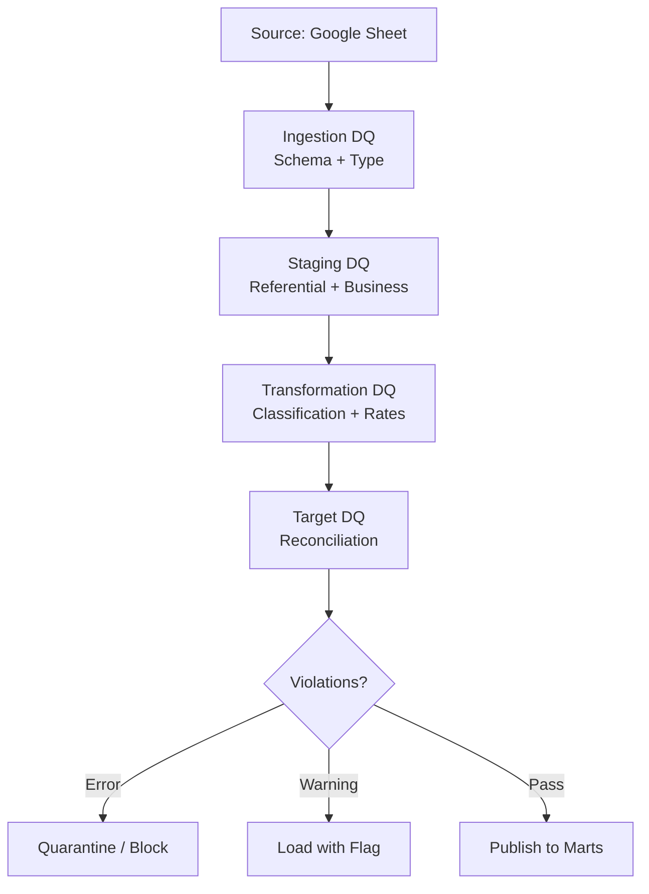
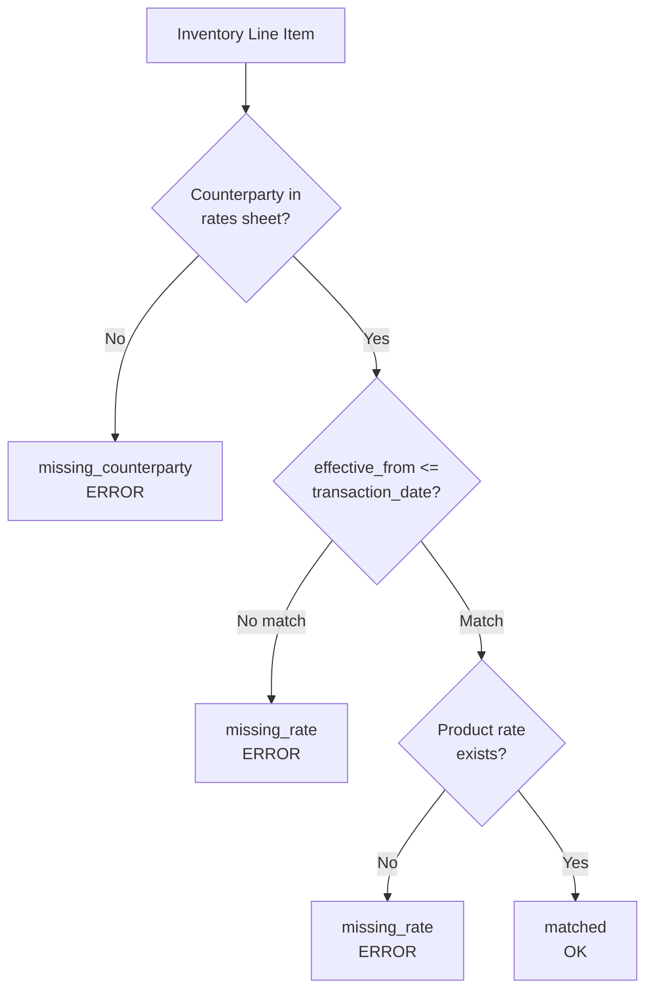
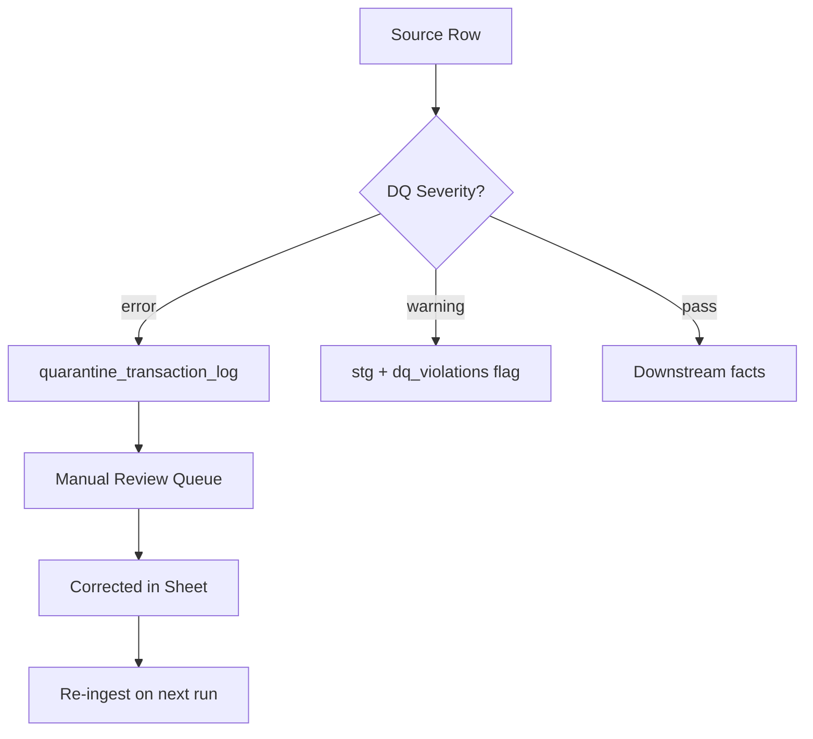

# Vegan Basket — Data Quality Rules

> **Status:** Draft — source of truth for ETL implementation
> **Last updated:** 2026-06-21
> **Depends on:** [business_rules.md](./business_rules.md), [data_dictionary.md](./data_dictionary.md)

---

## 1. Data Quality Framework



### 1.1 Severity Levels

| Severity | Behavior | Description |
|---|---|---|
| `error` | Row or field blocked from downstream facts | Must be fixed or manually overridden |
| `warning` | Row loaded with flag in `dq_violations` | Review recommended; does not block load |
| `info` | Logged only | Observability; no action required |

### 1.2 Rule ID Convention

```
{layer}_{table}_{check_name}
```

Example: `stg_transaction_log_missing_vendor`

### 1.3 Validation Mart (Phase 2 — Implemented)

Warning-oriented checks run in dbt after staging and intermediate models. **Violations never block dashboard generation.**

| Model | Grain | Purpose |
|---|---|---|
| `quality.validation_details` | source row × check (× sub-check) | Row-level warnings for founder review |
| `quality.validation_summary` | check + one `overall` row | Pass rates, violation counts, quality score |

**Quality score (0–100):** Average of per-check pass rates, where each check scores `(1 − violating_rows / active_rows) × 100`.

**Overall metrics on the `overall` row:**

| Column | Meaning |
|---|---|
| `quality_score` | Average of the nine per-check scores |
| `row_pass_rate_pct` | Share of active rows with zero warnings |
| `warning_rate_pct` | Share of active rows with at least one warning |

**Active checks (all `warning` severity):**

| Check ID | Condition |
|---|---|
| `quality_unknown_vendor` | Purchase vendor not in Vendor Rates sheet |
| `quality_unknown_customer` | Sale customer not in Customer Rates sheet |
| `quality_missing_rate` | Counterparty in rates sheet but no applicable rate for date/product |
| `quality_future_transaction_date` | `resolved_transaction_date` after today (IST) |
| `quality_invalid_transaction_type` | Type not `Purchase` or `Sale` |
| `quality_invalid_payment_mode` | Non-zero payment with mode other than `Cash` / `Online` |
| `quality_negative_quantity` | Any product quantity below zero |
| `quality_negative_payment` | `payment_rs` below zero (refund/adjustment) |
| `quality_suspicious_business_event` | Both names populated; vendor on sale; customer on purchase; no-op row |

Suspicious-event sub-checks: `both_counterparties_populated`, `vendor_on_sale`, `customer_on_purchase`, `noop_row`.

dbt tests on structural columns remain hard failures; business-rule tests use `severity: warn` so the pipeline completes and warnings surface in the quality tables.

---

## 2. Ingestion Layer Rules

Applied when reading from Google Sheets API.

| Rule ID | Check | Severity | Condition | Action |
|---|---|---|---|---|
| `ingest_schema_column_missing` | Required column present | `error` | Expected column header not found in sheet | Abort load; alert |
| `ingest_schema_extra_column` | Unexpected columns | `warning` | Column not in data dictionary | Log; ignore column |
| `ingest_empty_sheet` | Sheet has data | `error` | Sheet has only header row | Abort load; alert |
| `ingest_row_empty` | Non-empty rows | `warning` | Row has all blank values | Skip row; log |
| `ingest_api_failure` | API connectivity | `error` | Google Sheets API error | Retry; alert on exhaustion |
| `ingest_source_row_deleted` | Source row removed | `warning` | `source_row_id` missing from current extract vs prior load | Soft-delete staging + facts |
| `ingest_source_row_reactivated` | Deleted row reappeared | `info` | Previously soft-deleted `source_row_id` present again | Clear soft-delete; load |

---

## 3. Staging Layer Rules — Transaction Log

| Rule ID | Check | Severity | Condition | Action |
|---|---|---|---|---|
| `stg_txn_type_invalid` | Valid transaction type | `error` | `transaction_type` NOT IN (`Purchase`, `Sale`) | Quarantine row |
| `stg_txn_type_null` | Transaction type present | `error` | `transaction_type` IS NULL | Quarantine row |
| `stg_txn_timestamp_null` | Timestamp present | `error` | `timestamp` IS NULL | Quarantine row |
| `stg_txn_timestamp_future` | Timestamp not in future | `warning` | `timestamp` > `CURRENT_TIMESTAMP` + 5 min | Flag; load |
| `stg_txn_date_future` | Transaction date not in future | `warning` | `resolved_transaction_date` > `CURRENT_DATE` | Flag; load |
| `stg_txn_date_too_old` | Transaction date reasonable | `warning` | `resolved_transaction_date` < `2020-01-01` | Flag; load |
| `stg_txn_vendor_required` | Vendor on purchase | `error` | `transaction_type = Purchase` AND `vendor_name` IS NULL/blank | Quarantine row |
| `stg_txn_customer_required` | Customer on sale | `error` | `transaction_type = Sale` AND `customer_name` IS NULL/blank | Quarantine row |
| `stg_txn_vendor_on_sale` | No vendor on sale | `warning` | `transaction_type = Sale` AND `vendor_name` IS NOT NULL/blank | Flag; load |
| `stg_txn_customer_on_purchase` | No customer on purchase | `warning` | `transaction_type = Purchase` AND `customer_name` IS NOT NULL/blank | Flag; load |
| `stg_txn_both_counterparties` | Single counterparty expected | `warning` | Both `vendor_name` AND `customer_name` are NOT NULL/blank | Flag; load; use `transaction_type` for active counterparty |
| `stg_txn_payment_negative` | Refund/adjustment payment | `warning` | `payment_rs` < 0 | Flag; load (refund/adjustment) |
| `stg_txn_qty_negative` | Non-negative quantities | `error` | Any product qty < 0 | Quarantine row |
| `stg_txn_payment_mode_invalid` | Valid payment mode | `error` | `payment_mode` NOT IN (`Cash`, `Online`, NULL, '') | Quarantine row |
| `stg_txn_payment_mode_default` | Payment mode default | `warning` | `payment_rs` != 0 AND `payment_mode` IS NULL/blank | Auto-default to `Cash` in staging; flag |
| `stg_txn_noop_row` | Row has activity | `error` | `total_qty_kg = 0` AND `payment_rs = 0` | Quarantine row |
| `stg_txn_qty_not_numeric` | Numeric quantities | `error` | Product qty fails cast to DECIMAL | Quarantine row |
| `stg_txn_payment_not_numeric` | Numeric payment | `error` | `payment_rs` fails cast to DECIMAL | Quarantine row |
| `stg_txn_name_whitespace` | Trimmed names | `warning` | Leading/trailing whitespace in names | Auto-trim; flag original |
| `stg_txn_duplicate_submission` | Duplicate detection | `warning` | Identical row within 60 seconds | Flag; load both |

> **Resolved:** Negative payments are supported as refunds/adjustments (`stg_txn_payment_negative` = `warning`). Quantities remain `error` if negative.

---

## 4. Staging Layer Rules — Vendor Rates

| Rule ID | Check | Severity | Condition | Action |
|---|---|---|---|---|
| `stg_vr_effective_from_null` | Effective date present | `error` | `effective_from` IS NULL | Quarantine row |
| `stg_vr_vendor_null` | Vendor name present | `error` | `vendor_name` IS NULL/blank | Quarantine row |
| `stg_vr_rate_negative` | Non-negative rates | `error` | Any rate column < 0 | Quarantine row |
| `stg_vr_rate_not_numeric` | Numeric rates | `error` | Rate column fails cast | Quarantine row |
| `stg_vr_all_rates_null` | At least one rate | `warning` | All five product rates are NULL/0 | Flag; load |
| `stg_vr_duplicate_key` | Unique effective date + vendor | `error` | Duplicate `(effective_from, vendor_name)` | Quarantine duplicates |
| `stg_vr_effective_from_future` | Future effective date | `info` | `effective_from` > `CURRENT_DATE` | Log; load (valid for pre-set rates) |

---

## 5. Staging Layer Rules — Customer Rates

| Rule ID | Check | Severity | Condition | Action |
|---|---|---|---|---|
| `stg_cr_effective_from_null` | Effective date present | `error` | `effective_from` IS NULL | Quarantine row |
| `stg_cr_customer_null` | Customer name present | `error` | `customer_name` IS NULL/blank | Quarantine row |
| `stg_cr_rate_negative` | Non-negative rates | `error` | Any rate column < 0 | Quarantine row |
| `stg_cr_rate_not_numeric` | Numeric rates | `error` | Rate column fails cast | Quarantine row |
| `stg_cr_all_rates_null` | At least one rate | `warning` | All five product rates are NULL/0 | Flag; load |
| `stg_cr_duplicate_key` | Unique effective date + customer | `error` | Duplicate `(effective_from, customer_name)` | Quarantine duplicates |
| `stg_cr_effective_from_future` | Future effective date | `info` | `effective_from` > `CURRENT_DATE` | Log; load |

---

## 6. Transformation Layer Rules

Applied during classification, rate lookup, and fact generation.

### 6.1 Classification Rules

| Rule ID | Check | Severity | Condition | Action |
|---|---|---|---|---|
| `xform_class_unknown` | Classifiable row | `error` | Row passes staging but produces zero events | Quarantine |
| `xform_class_multi_event` | Multi-event rows | `info` | Row produces 2 events (inventory + payment) | Log; load |
| `xform_class_inventory_no_qty` | Inventory has quantity | `error` | Inventory event with qty = 0 | Block event |
| `xform_class_payment_no_amount` | Payment has amount | `error` | Payment event with amount = 0 | Block event |

### 6.2 Rate Lookup Rules

| Rule ID | Check | Severity | Condition | Action |
|---|---|---|---|---|
| `xform_rate_missing_counterparty` | Counterparty in rates | `error` | Vendor/customer not found in rates sheet | `rate_lookup_status = missing_counterparty` |
| `xform_rate_missing_product` | Product rate exists | `error` | Matched rate row but product rate is NULL/0 | `rate_lookup_status = missing_rate` |
| `xform_rate_no_match` | Rate found | `error` | No rate row with `effective_from <= transaction_date` | `rate_lookup_status = missing_rate` |
| `xform_rate_multiple_match` | Single rate match | `error` | Multiple rows tie on max `effective_from` | Use deterministic tie-break; flag |
| `xform_rate_zero` | Positive rate | `warning` | Matched rate = 0 | Flag; load with zero value |
| `xform_rate_counterparty_name_mismatch` | Name consistency | `warning` | Name in txn differs in case/spacing from rates | Use normalized match; flag |



### 6.3 Referential Integrity Rules

| Rule ID | Check | Severity | Condition | Action |
|---|---|---|---|---|
| `xform_ref_vendor_key` | Vendor FK valid | `error` | `vendor_key` not in `dim_vendor` | Block event |
| `xform_ref_customer_key` | Customer FK valid | `error` | `customer_key` not in `dim_customer` | Block event |
| `xform_ref_product_key` | Product FK valid | `error` | `product_key` not in `dim_product` | Block event |
| `xform_ref_source_row` | Source traceability | `error` | `source_row_id` not in staging | Block event |

---

## 7. Target Layer Rules — Reconciliation

| Rule ID | Check | Severity | Condition | Action |
|---|---|---|---|---|
| `tgt_row_count_staging` | Staging row count stable | `warning` | `COUNT(stg)` differs from prior load by > 10% | Alert |
| `tgt_event_coverage` | All valid rows produce events | `error` | Valid staging row has zero fact events | Alert |
| `tgt_payment_sum` | Payment totals reconcile | `warning` | `SUM(fact_payment.amount)` ≠ `SUM(stg.payment WHERE payment_rs != 0)` | Alert |
| `tgt_qty_sum` | Quantity totals reconcile | `warning` | `SUM(fact_inventory.quantity)` ≠ `SUM(stg product qtys)` | Alert |
| `tgt_orphan_facts` | No orphan fact rows | `error` | Active fact row without matching active staging row | Alert |
| `tgt_deleted_row_in_marts` | Marts exclude deleted rows | `error` | Mart row references `is_deleted = true` fact/staging row | Block publish |
| `tgt_orphan_deleted_fact` | Deleted fact traceability | `warning` | Soft-deleted fact without staging deletion | Alert |
| `tgt_ar_negative` | AR balance sanity | `warning` | Customer AR < −1000 Rs (configurable) | Flag for review |
| `tgt_ap_negative` | AP balance sanity | `warning` | Vendor AP < −1000 Rs (configurable) | Flag for review |
| `tgt_inventory_negative` | Inventory sanity | `warning` | Product on-hand qty < 0 | Flag for review |

---

## 8. Quarantine Strategy



### 8.1 `quarantine_transaction_log`

| Column | Description |
|---|---|
| `quarantine_id` | PK |
| `source_row_id` | Original row reference |
| `raw_row_json` | Full raw row payload |
| `rule_ids` | Comma-separated failed rule IDs |
| `quarantined_at` | Timestamp |
| `resolved_at` | NULL until fixed |
| `resolution_notes` | Manual notes |

> **Assumption:** Quarantined rows are excluded from facts until source data is corrected and re-ingested.

---

## 9. Data Quality Monitoring

### 9.1 Per-Load Dashboard Metrics

| Metric | Source | Threshold |
|---|---|---|
| Error rate | `dq_violations` | Alert if > 5% of rows |
| Warning rate | `dq_violations` | Alert if > 15% of rows |
| Rate match rate | `fact_inventory_movement` | Alert if < 95% |
| Quarantine count | `quarantine_transaction_log` | Alert if > 0 new errors |
| Reconciliation drift | Target reconciliation rules | Alert on any failure |

### 9.2 Monitoring Cadence

| Check | Frequency |
|---|---|
| Ingestion + staging DQ | Every ETL run |
| Transformation DQ | Every ETL run |
| Reconciliation | Every ETL run |
| Trend analysis | Weekly |

---

## 10. Test Scenarios (Acceptance)

These scenarios must pass before go-live.

| # | Scenario | Input | Expected Outcome |
|---|---|---|---|
| T1 | Purchase, qty only | Bulk 10kg, payment 0 | 1 inventory line; no payment event |
| T2 | Purchase, payment only | All qty 0, payment 500 | 1 vendor payment; no inventory |
| T3 | Purchase, qty + payment | Bulk 10kg, payment 500 | 1 inventory line + 1 payment |
| T4 | Sale, qty only | Pannet 5kg, payment 0 | 1 sale line; no collection |
| T5 | Sale, payment only | All qty 0, payment 300 | 1 collection; no sale line |
| T6 | Sale, qty + payment | Lahsun 2kg, payment 300 | 1 sale line + 1 collection |
| T7 | Multi-product row | Bulk 10, Corn 5, payment 0 | 2 inventory lines |
| T8 | No-op row | All qty 0, payment 0 | Quarantined (error) |
| T9 | Missing vendor on purchase | Sale type with vendor only | Quarantined (error) |
| T10 | Rate lookup | Vendor rate effective 2026-01-01, txn 2026-03-15 | Correct rate applied |
| T11 | Rate change | New rate 2026-04-01; txn before and after | Different rates applied |
| T12 | Missing rate | Unknown vendor | `missing_counterparty` status |
| T13 | Backdated transaction | Transaction date = 7 days ago | Uses backdated date for rate lookup |
| T14 | Payment mode missing | Payment 100, mode blank | Default to `Cash`; DQ `warning`; load |

---

## 11. Assumptions

| # | Assumption |
|---|---|
| Q1 | Google Forms enforces some validation at entry; DQ is the backstop |
| Q2 | Auto-trimming whitespace on names is acceptable |
| Q3 | Duplicate submissions within 60s are flagged as `warning` and both rows are loaded |
| Q4 | Quarantine threshold of 5% error rate is acceptable for initial launch |
| Q5 | Negative AR/AP beyond Rs 1000 threshold indicates data issues |
| Q6 | Re-ingestion after source fix is the resolution path (no in-ETL correction) |

---

## 12. Open Questions

1. Should refunds (negative payment) be supported? If yes, which rules change severity?
> **Answer:** Yes. `stg_txn_payment_negative` severity is `warning`; row loads as refund/adjustment.
2. Duplicate submission deduplication — auto-dedupe or manual only?
> **Answer:** Manual only — flag as `warning` and load both duplicate rows.
3. Acceptable error rate threshold for production?
> **Answer:** The acceptable error rate threshold for production is 5%.
4. Who receives DQ alerts (email, Slack)?
> **Answer:** DQ alerts should be sent to the team via Telegram.
5. Should warnings block mart publication or only errors?
> **Answer:** Warnings should not block mart publication.
6. Rate for unknown vendor/customer — hard fail or allow with zero value?
> **Answer:** The rate for unknown vendor/customer should be hard failed.
7. Historical bad data in sheet — clean upfront or quarantine incrementally?
> **Answer:** Historical bad data in sheet should be quarantine incrementally.
