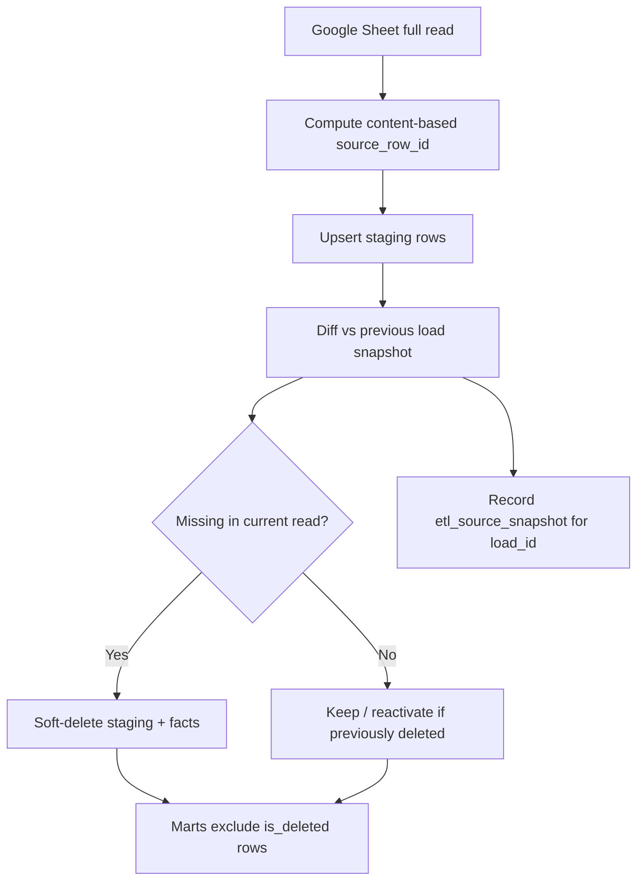

# Deletion Handling and Data Retention

> **Status:** Accepted — source of truth for row deletion and soft-delete behavior
> **Last updated:** 2026-06-21
> **Depends on:** [architecture_decisions.md](./architecture_decisions.md), [data_dictionary.md](./data_dictionary.md)

---

## 1. Problem Statement

Google Sheets has **no change-data-capture (CDC) API**. Operators can:

- Delete a row entirely
- Insert rows mid-sheet (shifting row numbers)
- Edit cell values in place

Row-number-based keys (`{sheet_id}:{tab}:{row_number}`) break when the sheet layout changes. Deleted rows simply disappear from the next API read.

---

## 2. Design Summary



| Layer | Strategy |
|---|---|
| **Source identity** | Content fingerprint (`source_row_id`), not row number |
| **Deletion detection** | Full-sheet snapshot diff per load |
| **Warehouse retention** | Soft delete (`is_deleted = true`); rows kept for audit |
| **Reporting** | Marts and KPIs filter active rows only |

---

## 3. Source Row Identity

### 3.1 `source_row_id` format

```
{sheet_id}:{sheet_tab}:{content_fingerprint[:16]}
```

`content_fingerprint` = SHA-256 of normalized business columns (JSON, sorted keys).

Implemented in `pipelines/identity.py`.

### 3.2 Transaction Log fingerprint columns

| Column | Included |
|---|---|
| `timestamp` | Yes |
| `transaction_date_raw` | Yes |
| `transaction_type` | Yes |
| `vendor_name` | Yes |
| `customer_name` | Yes |
| `payment_rs` | Yes |
| `payment_mode` | Yes |
| All five product qty columns | Yes |
| `remarks` | Yes |
| `source_row_number` | **No** — audit only |

### 3.3 Rate sheet fingerprint columns

Vendor Rates / Customer Rates:

- `effective_from`
- `vendor_name` or `customer_name`
- All five product rate columns
- `remarks`

### 3.4 Collision handling

Google Forms `Timestamp` should uniquely identify submissions. If two rows in the **same load** produce an identical fingerprint (manual copy/paste), append a disambiguator:

```
{source_row_id}:row{source_row_number}
```

Both rows load; `stg_txn_duplicate_submission` records a DQ `warning`.

### 3.5 Audit column: `source_row_number`

The current 1-based row number from the Sheets API is stored for operator traceability but **must not** be used as the sole identity key.

---

## 4. Source Deletion Handling

### 4.1 Assumptions

| # | Assumption |
|---|---|
| R1 | Ingestion frequency is **daily** (full sheet read) |
| R2 | Row deletion in the sheet means the business transaction should **no longer appear in reporting** |
| R3 | Deleted rows may reappear if the operator re-adds the same transaction (reactivation) |
| R4 | Hard deletes in the warehouse are **not** performed in normal operations |

### 4.2 Detection algorithm (each load)

1. Read all rows from sheet tab via Google Sheets API
2. Compute `source_row_id` for each row
3. Compare current ID set with the **previous successful load** snapshot (`etl_source_snapshot`)
4. IDs in previous load but **not** in current read → **source deleted**
5. Persist current snapshot with `load_id` and `is_present = true`

Implemented in `pipelines/snapshot.py` and orchestrated by `pipelines/deletion.py`.

### 4.3 `etl_source_snapshot` table

| Column | Description |
|---|---|
| `load_id` | Pipeline run identifier |
| `sheet_tab` | Sheet tab name |
| `source_row_id` | Content-based identity |
| `source_row_number` | Row number at extract time |
| `first_seen_at` | First observation in this load record |
| `last_seen_at` | Last observation timestamp |
| `is_present` | Whether row was in that load's extract |

Primary key: `(load_id, sheet_tab, source_row_id)`

---

## 5. Soft-Delete Strategy

### 5.1 Lifecycle columns (staging and facts)

| Column | Type | Description |
|---|---|---|
| `is_deleted` | `BOOLEAN` | `false` = active; `true` = excluded from marts |
| `deleted_at` | `TIMESTAMP` | When soft-delete was applied |
| `deletion_reason` | `STRING` | `source_removed`, `manual_override` (future) |
| `deleted_by_load_id` | `STRING` | Load that detected/applied deletion |
| `last_seen_load_id` | `STRING` | Last load where row was seen in source |
| `last_seen_at` | `TIMESTAMP` | Timestamp of last source sighting |
| `source_row_number` | `INTEGER` | Latest known sheet row number (audit) |

### 5.2 Staging soft delete

When a `source_row_id` disappears from the source read:

```sql
UPDATE stg_*
SET is_deleted = TRUE,
    deleted_at = CURRENT_TIMESTAMP,
    deletion_reason = 'source_removed',
    deleted_by_load_id = :load_id
WHERE source_row_id IN (:missing_ids)
  AND COALESCE(is_deleted, FALSE) = FALSE
```

### 5.3 Fact soft delete

Facts inherit deletion from staging via dbt macro `soft_delete_from_staging`:

- `fact_inventory_movement` rows match on `source_row_id` (+ product for inventory lines)
- `fact_payment` rows match on `source_row_id`
- Deleted facts remain in the warehouse for audit and reconciliation

### 5.4 Reactivation

If a previously deleted `source_row_id` **reappears** in a later source read:

- Clear `is_deleted` and deletion metadata on staging
- Propagate reactivation to facts on next dbt run
- Log DQ `info` event (optional observability)

### 5.5 Mart and KPI filtering

All mart models and KPI queries use:

```sql
WHERE COALESCE(is_deleted, FALSE) = FALSE
```

dbt helper macro: `{{ active_rows(ref('stg_transaction_log')) }}`

### 5.6 Content edits vs deletions

| Operator action | `source_row_id` | Warehouse behavior |
|---|---|---|
| Delete row from sheet | Old ID missing | Old rows soft-deleted |
| Edit transaction values | New ID (content changed) | Old ID soft-deleted; new ID inserted |
| Re-enter identical transaction | Same ID returns | Reactivated if previously deleted |
| Insert row mid-sheet | Unchanged for unaffected rows | No false deletion (identity stable) |

---

## 6. Data Quality Rules

| Rule ID | Check | Severity | Action |
|---|---|---|---|
| `ingest_source_row_deleted` | Source row removed since prior load | `warning` | Soft-delete staging + facts |
| `ingest_source_row_reactivated` | Previously deleted row reappeared | `info` | Clear soft-delete flags |
| `tgt_deleted_row_in_marts` | Mart includes soft-deleted row | `error` | Block publish / fix model |
| `tgt_orphan_deleted_fact` | Fact soft-deleted without staging match | `warning` | Alert for investigation |

---

## 7. Operational Runbook

### 7.1 Operator deletes a row by mistake

1. Daily load soft-deletes the transaction in analytics
2. Operator re-adds the row to the Google Sheet (same or corrected values)
3. Next load reactivates if `source_row_id` matches; otherwise creates a new row

### 7.2 Operator corrects a transaction

1. Edit values in the sheet
2. New `source_row_id` is generated
3. Old facts soft-deleted; new facts created on next transform
4. Historical audit preserved via deleted rows

### 7.3 Monitoring

Alert (Telegram) when:

- `ingest_source_row_deleted` count > 0 on a load
- Any `tgt_deleted_row_in_marts` failure

---

## 8. Implementation References

| Component | Location |
|---|---|
| Identity hashing | `pipelines/identity.py` |
| Snapshot diff + soft delete | `pipelines/snapshot.py` |
| Orchestration | `pipelines/deletion.py` |
| Active-row macro | `dbt/macros/active_rows.sql` |
| Fact propagation macro | `dbt/macros/soft_delete_from_staging.sql` |
| Tests | `tests/test_identity.py`, `tests/test_snapshot.py` |

---

## 9. Related ADRs

- [ADR-012](./architecture_decisions.md#adr-012-stable-source-row-identity) — Stable source row identity
- [ADR-016](./architecture_decisions.md#adr-016-source-deletion-via-snapshot-diff--soft-delete) — Snapshot diff + soft delete
