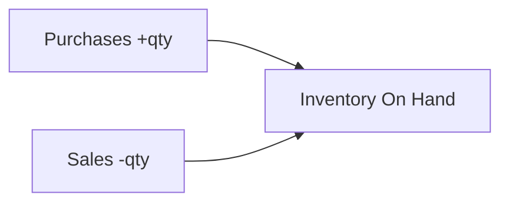
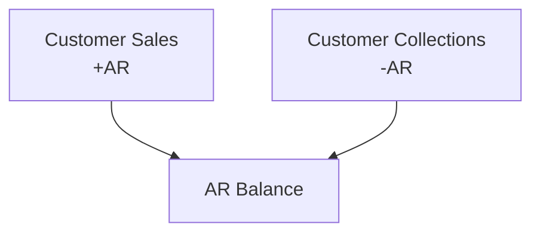
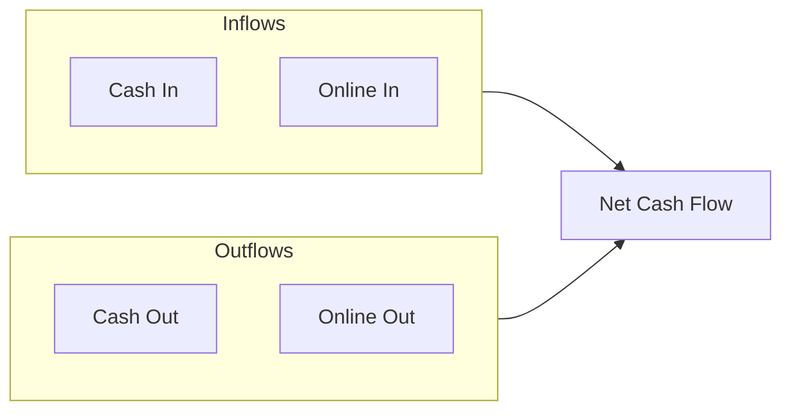
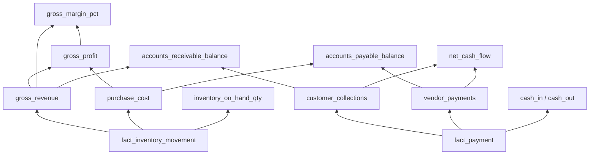

# Vegan Basket — Metric Definitions

> **Status:** Draft — source of truth for ETL implementation
> **Last updated:** 2026-06-20
> **Depends on:** [business_rules.md](./business_rules.md), [data_dictionary.md](./data_dictionary.md)

---

## 1. Metric Design Principles

| Principle | Rule |
|---|---|
| Grain | Every metric declares its grain explicitly |
| Source of truth | Derived from `fact_inventory_movement` and `fact_payment` unless noted |
| Valuation | Inventory values use rate-derived `line_value_rs`, not Payment field |
| Time | Filtered by `transaction_date` unless noted |
| Null handling | Exclude rows where `rate_lookup_status != 'matched'` from value-based metrics by default |
| Currency | All monetary metrics in Rs (INR) |

---

## 2. Metric Catalog Overview

```mermaid
graph TD
    A["Vegan Basket Metrics"]

    A --> B["Sales"]
    B --> B1["Gross Revenue"]
    B --> B2["Revenue by Product"]
    B --> B3["Revenue by Customer"]

    A --> C["Purchases"]
    C --> C1["Purchase Cost"]
    C --> C2["Purchase Cost by Product"]
    C --> C3["Purchase Cost by Vendor"]

    A --> D["Profitability"]
    D --> D1["Gross Profit"]
    D --> D2["Gross Margin %"]

    A --> E["Inventory"]
    E --> E1["On Hand Qty"]
    E --> E2["On Hand Value"]

    A --> F["Receivables"]
    F --> F1["AR Balance"]
    F --> F2["Collections"]

    A --> G["Payables"]
    G --> G1["AP Balance"]
    G --> G2["Vendor Payments"]

    A --> H["Cash"]
    H --> H1["Cash In"]
    H --> H2["Cash Out"]
    H --> H3["Net Cash Flow"]
```

---

## 3. Sales Metrics

### 3.1 `gross_revenue`

| Attribute | Value |
|---|---|
| **Definition** | Total value of goods sold to customers |
| **Formula** | `SUM(line_value_rs) WHERE movement_type = 'customer_sale' AND rate_lookup_status = 'matched'` |
| **Grain** | Aggregatable to: day, week, month, product, customer |
| **Source table** | `fact_inventory_movement` |
| **Unit** | Rs |
| **Filters** | `transaction_date` in reporting period |

### 3.2 `revenue_by_product`

| Attribute | Value |
|---|---|
| **Definition** | Gross revenue segmented by product |
| **Formula** | `gross_revenue` grouped by `product_key` |
| **Grain** | product × time period |

### 3.3 `revenue_by_customer`

| Attribute | Value |
|---|---|
| **Definition** | Gross revenue segmented by customer |
| **Formula** | `gross_revenue` grouped by `customer_key` |
| **Grain** | customer × time period |

### 3.4 `sales_quantity_kg`

| Attribute | Value |
|---|---|
| **Definition** | Total quantity sold |
| **Formula** | `SUM(quantity_kg) WHERE movement_type = 'customer_sale'` |
| **Grain** | Aggregatable to product, customer, time |
| **Unit** | kg |
| **Note** | Includes rows with missing rates (qty is source-derived) |

### 3.5 `avg_selling_price_per_kg`

| Attribute | Value |
|---|---|
| **Definition** | Average realized selling price per kg |
| **Formula** | `gross_revenue / sales_quantity_kg` |
| **Grain** | product × time period (recommended) |
| **Guard** | Returns NULL if `sales_quantity_kg = 0` |

---

## 4. Purchase Metrics

### 4.1 `purchase_cost`

| Attribute | Value |
|---|---|
| **Definition** | Total cost of goods purchased from vendors |
| **Formula** | `SUM(line_value_rs) WHERE movement_type = 'inventory_purchase' AND rate_lookup_status = 'matched'` |
| **Grain** | Aggregatable to: day, product, vendor |
| **Source table** | `fact_inventory_movement` |
| **Unit** | Rs |

### 4.2 `purchase_cost_by_product`

| Attribute | Value |
|---|---|
| **Definition** | Purchase cost segmented by product |
| **Formula** | `purchase_cost` grouped by `product_key` |

### 4.3 `purchase_cost_by_vendor`

| Attribute | Value |
|---|---|
| **Definition** | Purchase cost segmented by vendor |
| **Formula** | `purchase_cost` grouped by `vendor_key` |

### 4.4 `purchase_quantity_kg`

| Attribute | Value |
|---|---|
| **Definition** | Total quantity purchased |
| **Formula** | `SUM(quantity_kg) WHERE movement_type = 'inventory_purchase'` |
| **Unit** | kg |

### 4.5 `avg_purchase_price_per_kg`

| Attribute | Value |
|---|---|
| **Definition** | Average purchase price per kg |
| **Formula** | `purchase_cost / purchase_quantity_kg` |
| **Guard** | Returns NULL if `purchase_quantity_kg = 0` |

---

## 5. Profitability Metrics

### 5.1 `gross_profit`

| Attribute | Value |
|---|---|
| **Definition** | Revenue minus cost of goods sold |
| **Formula** | `gross_revenue - purchase_cost` |
| **Grain** | time period (and optionally product) |
| **Note** | Product-level gross profit is meaningful; customer/vendor level requires product-level COGS allocation |

> **Assumption:** Company-level gross profit = total sales value − total purchase value. This does not attempt FIFO/LIFO inventory costing.

> **Open question:** Should product-level gross profit use matched purchase cost for the same product (volume-based) or overall blended cost?

### 5.2 `gross_margin_pct`

| Attribute | Value |
|---|---|
| **Definition** | Gross profit as percentage of revenue |
| **Formula** | `(gross_profit / gross_revenue) × 100` |
| **Guard** | Returns NULL if `gross_revenue = 0` |
| **Unit** | Percentage |

### 5.3 `product_gross_profit`

| Attribute | Value |
|---|---|
| **Definition** | Profit per product |
| **Formula** | `revenue_by_product - purchase_cost_by_product` |
| **Grain** | product × time period |

---

## 6. Inventory Metrics

### 6.1 `inventory_on_hand_qty_kg`

| Attribute | Value |
|---|---|
| **Definition** | Current physical inventory by product |
| **Formula** | `SUM(quantity_kg) WHERE movement_type = 'inventory_purchase'` − `SUM(quantity_kg) WHERE movement_type = 'customer_sale'` |
| **Grain** | product (as of reporting date) |
| **Unit** | kg |
| **Filter** | `transaction_date <= reporting_date` |

### 6.2 `inventory_on_hand_value_rs`

| Attribute | Value |
|---|---|
| **Definition** | Estimated value of inventory on hand |
| **Formula** | `inventory_on_hand_qty_kg × latest_purchase_rate` per product |
| **Grain** | product |
| **Rate source** | Latest vendor rate (any vendor) or weighted average purchase rate |

> **Open question:** Valuation method for on-hand inventory — latest purchase rate, weighted average, or specific vendor rate?

### 6.3 `inventory_turnover_ratio`

| Attribute | Value |
|---|---|
| **Definition** | How quickly inventory is sold |
| **Formula** | `purchase_cost / avg_inventory_value` |
| **Grain** | product × period (monthly recommended) |

> **Deferred:** Requires agreed inventory valuation method.

---

## 7. Accounts Receivable Metrics

### 7.1 `customer_collections`

| Attribute | Value |
|---|---|
| **Definition** | Total cash received from customers |
| **Formula** | `SUM(amount_rs) WHERE payment_type = 'customer_collection'` |
| **Grain** | customer × time period |
| **Source table** | `fact_payment` |

### 7.2 `accounts_receivable_balance`

| Attribute | Value |
|---|---|
| **Definition** | Outstanding amount owed by customers |
| **Formula** | `cumulative_gross_revenue_by_customer - cumulative_customer_collections_by_customer` |
| **Grain** | customer (as of reporting date) |
| **Unit** | Rs |

### 7.3 `total_ar_outstanding`

| Attribute | Value |
|---|---|
| **Definition** | Sum of all customer AR balances |
| **Formula** | `SUM(accounts_receivable_balance)` across all customers |
| **Grain** | company (as of reporting date) |

### 7.4 `collection_rate_pct`

| Attribute | Value |
|---|---|
| **Definition** | Percentage of billed sales collected in period |
| **Formula** | `(customer_collections / gross_revenue) × 100` |
| **Grain** | time period |
| **Guard** | NULL if `gross_revenue = 0` |

> **Note:** This compares collections received in period to sales made in period — not a true aging metric. See open questions.

### 7.5 `days_sales_outstanding` (DSO)

| Attribute | Value |
|---|---|
| **Definition** | Average days to collect payment |
| **Formula** | `total_ar_outstanding / (gross_revenue / days_in_period)` |
| **Status** | **Deferred** — requires agreed AR aging methodology |

---

## 8. Accounts Payable Metrics

### 8.1 `vendor_payments`

| Attribute | Value |
|---|---|
| **Definition** | Total cash paid to vendors |
| **Formula** | `SUM(amount_rs) WHERE payment_type = 'vendor_payment'` |
| **Grain** | vendor × time period |
| **Source table** | `fact_payment` |

### 8.2 `accounts_payable_balance`

| Attribute | Value |
|---|---|
| **Definition** | Outstanding amount owed to vendors |
| **Formula** | `cumulative_purchase_cost_by_vendor - cumulative_vendor_payments_by_vendor` |
| **Grain** | vendor (as of reporting date) |
| **Unit** | Rs |

### 8.3 `total_ap_outstanding`

| Attribute | Value |
|---|---|
| **Definition** | Sum of all vendor AP balances |
| **Formula** | `SUM(accounts_payable_balance)` across all vendors |

---

## 9. Cash Flow Metrics

### 9.1 `cash_in`

| Attribute | Value |
|---|---|
| **Definition** | Total cash received (customer collections) |
| **Formula** | `SUM(amount_rs) WHERE payment_type = 'customer_collection' AND payment_mode = 'Cash'` |
| **Note** | Physical cash only |

### 9.2 `cash_out`

| Attribute | Value |
|---|---|
| **Definition** | Total cash paid (vendor payments) |
| **Formula** | `SUM(amount_rs) WHERE payment_type = 'vendor_payment' AND payment_mode = 'Cash'` |

### 9.3 `online_in`

| Attribute | Value |
|---|---|
| **Definition** | Total online receipts |
| **Formula** | `SUM(amount_rs) WHERE payment_type = 'customer_collection' AND payment_mode = 'Online'` |

### 9.4 `online_out`

| Attribute | Value |
|---|---|
| **Definition** | Total online payments to vendors |
| **Formula** | `SUM(amount_rs) WHERE payment_type = 'vendor_payment' AND payment_mode = 'Online'` |

### 9.5 `net_cash_flow`

| Attribute | Value |
|---|---|
| **Definition** | Net cash movement |
| **Formula** | `(cash_in + online_in) - (cash_out + online_out)` |
| **Grain** | time period |

---

## 10. Operational Metrics

### 10.1 `transaction_count`

| Attribute | Value |
|---|---|
| **Definition** | Number of form submissions |
| **Formula** | `COUNT(DISTINCT source_row_id)` from staging |
| **Grain** | time period |

### 10.2 `inventory_movement_count`

| Attribute | Value |
|---|---|
| **Definition** | Number of inventory line items |
| **Formula** | `COUNT(*)` from `fact_inventory_movement` |

### 10.3 `payment_event_count`

| Attribute | Value |
|---|---|
| **Definition** | Number of payment/collection events |
| **Formula** | `COUNT(*)` from `fact_payment` |

### 10.4 `data_quality_error_rate`

| Attribute | Value |
|---|---|
| **Definition** | Percentage of source rows with DQ errors |
| **Formula** | `COUNT(dq_violations WHERE severity = 'error') / COUNT(stg_transaction_log) × 100` |
| **Grain** | per load / cumulative |

### 10.5 `rate_match_rate`

| Attribute | Value |
|---|---|
| **Definition** | Percentage of inventory lines with matched rates |
| **Formula** | `COUNT(movements WHERE rate_lookup_status = 'matched') / COUNT(movements) × 100` |

### 10.6 `active_vendors`

| Attribute | Value |
|---|---|
| **Definition** | Vendors with at least one transaction in period |
| **Formula** | `COUNT(DISTINCT vendor_key)` from facts in period |

### 10.7 `active_customers`

| Attribute | Value |
|---|---|
| **Definition** | Customers with at least one transaction in period |
| **Formula** | `COUNT(DISTINCT customer_key)` from facts in period |

### 10.8 `data_quality_score`

| Attribute | Value |
|---|---|
| **Definition** | Composite score reflecting per-check pass rates |
| **Formula** | `AVG((1 − violating_rows / active_rows) × 100)` across nine validation checks |
| **Grain** | per pipeline run |
| **Source table** | `quality.validation_summary` (`check_id = 'overall'`) |
| **Unit** | 0–100 |

### 10.9 `data_quality_warning_rate`

| Attribute | Value |
|---|---|
| **Definition** | Share of active transaction rows with at least one warning |
| **Formula** | `rows_with_warnings / active_rows × 100` |
| **Grain** | per pipeline run |
| **Source table** | `quality.validation_summary` (`check_id = 'overall'`) |

---

## 11. Mart Tables (Recommended)

Pre-aggregated tables for reporting performance.

| Mart Table | Grain | Key Metrics |
|---|---|---|
| `mart_daily_sales` | date × product × customer | revenue, qty |
| `mart_daily_purchases` | date × product × vendor | cost, qty |
| `mart_daily_cash_flow` | date × payment_mode | in, out, net |
| `mart_customer_balances` | customer | ar_balance, total_sales, total_collections |
| `mart_vendor_balances` | vendor | ap_balance, total_purchases, total_payments |
| `mart_inventory_snapshot` | product × date | on_hand_qty, on_hand_value |
| `mart_monthly_pnl` | month | revenue, cost, gross_profit, margin |

---

## 12. Metric Dependency Graph

---

## 13. Assumptions

| # | Assumption |
|---|---|
| M1 | Value metrics exclude unmatched rates by default |
| M2 | Quantity metrics include all rows regardless of rate match |
| M3 | AR/AP are cumulative lifetime balances, not period snapshots of activity |
| M4 | Gross profit at company level = total sales − total purchases (not FIFO) |
| M5 | Cash metrics split by Payment Mode; "Online" includes all non-cash digital payments |
| M6 | All metrics use `transaction_date`, not `timestamp` |
| M7 | Reporting timezone is IST |

---

## 14. Open Questions

1. **Inventory valuation** for on-hand value metric — which method?
> **Answer:** The latest purchase rate is the best method for on-hand value metric.
2. **Product-level gross profit** — simple difference or requires COGS matching?
> **Answer:** The simple difference is the best method for product-level gross profit.
3. **AR aging** — is DSO / aging buckets needed?
> **Answer:** DSO / aging buckets are not needed.
4. **Combined rows** (sale + collection in one entry) — does collection rate double-count?
> **Answer:** The collection rate does not double-count.
5. **Fiscal year** — calendar year or custom?
> **Answer:** The fiscal year is from April 1st to March 31st.
6. **Daily vs monthly** official reporting cadence?
> **Answer:** The official reporting cadence is daily.
7. Should unmatched-rate rows appear in a separate "unvalued" metric?
> **Answer:** Yes, unmatched-rate rows should appear in a separate `unvalued_sales_rs` metric (see §15.2).
8. Are there KPI targets / thresholds to document?
> **Answer:** Yes — provisional targets in [§15](#15-kpi-targets-provisional). Final values subject to client review.

---

## 15. KPI Targets (Provisional)

> **Status:** Working assumptions for dashboard alerts and go-live gates. **Subject to client review** — treat as starting points, not contractual SLAs.

Targets apply to **active rows only** (`is_deleted = false`) unless noted.

### 15.1 Data Quality & Pipeline

| KPI | Target | Warning | Critical | Notes |
|---|---|---|---|---|
| `data_quality_error_rate` | ≤ 3% | > 5% | > 10% | Per load; aligns with go-live gate |
| `data_quality_warning_rate` | ≤ 10% | > 15% | > 25% | Includes refunds, duplicate flags |
| `rate_match_rate` | ≥ 98% | < 95% | < 90% | Inventory lines with matched rates |
| `quarantine_new_errors` | 0 | ≥ 1 | ≥ 5 | New error-severity rows per load |
| `pipeline_runtime_minutes` | ≤ 3 | > 5 | > 10 | End-to-end extract + dbt |
| `pipeline_success_rate` (monthly) | 100% | < 100% | 2 consecutive failures | Daily scheduled run |
| `source_rows_soft_deleted` (per load) | 0 | ≥ 1 | ≥ 5 | Unexpected deletions — review with operator |

### 15.2 Financial & Operational (Monthly unless noted)

| KPI | Target | Warning | Critical | Notes |
|---|---|---|---|---|
| `gross_margin_pct` | 18–22% | < 15% | < 10% | Company-level; simple COGS model |
| `collection_rate_pct` | ≥ 85% | < 75% | < 60% | Collections ÷ gross revenue in period |
| `total_ar_outstanding` | Trend stable | +20% MoM | +40% MoM | No fixed cap; monitor trend |
| `total_ap_outstanding` | Trend stable | +20% MoM | +40% MoM | No fixed cap; monitor trend |
| `inventory_on_hand_qty_kg` (any product) | ≥ 0 kg | — | < 0 kg | Hard business rule — any negative triggers review |
| `unvalued_sales_rs` share of revenue | ≤ 2% | > 5% | > 10% | Unmatched-rate sale value ÷ gross revenue |
| `transaction_count` (daily) | 5–40 | < 3 | 0 on weekday | Low-volume produce trading baseline |
| `gross_revenue` (daily, informational) | ₹25,000–₹75,000 | < ₹10,000 | ₹0 on weekday | Planning baseline only |

### 15.3 Alert Routing

| Severity | Channel | Response |
|---|---|---|
| Critical | Telegram (immediate) | Investigate same business day |
| Warning | Telegram (daily digest) | Review within 2 business days |
| Info | Dashboard only | No action required |

### 15.4 Fiscal & Reporting Context

| Setting | Value |
|---|---|
| Fiscal year | April 1 – March 31 (IST) |
| Official cadence | Daily operational review; monthly P&L summary |
| Timezone | Asia/Kolkata |

### 15.5 Review Checklist (Client Sign-off)

- [ ] Confirm gross margin target band for product mix
- [ ] Confirm collection rate target vs credit terms with key customers
- [ ] Confirm daily revenue baseline range
- [ ] Confirm acceptable source-row deletion count per load (expected vs alert)
- [ ] Confirm Telegram recipients for critical alerts
