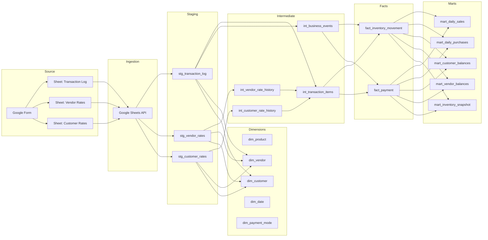
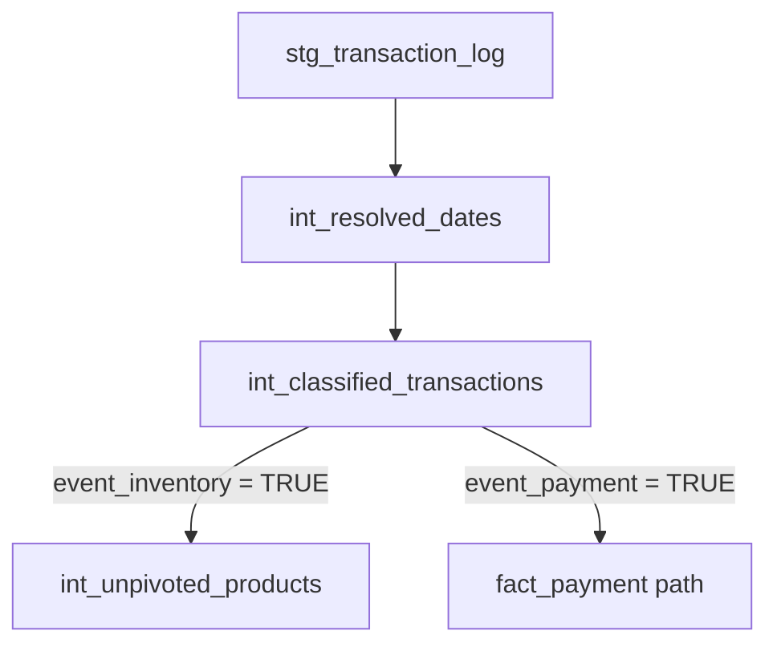

# Vegan Basket — Source to Target Mapping

> **Status:** Draft — source of truth for ETL implementation
> **Last updated:** 2026-06-21
> **Depends on:** [business_rules.md](./business_rules.md), [data_dictionary.md](./data_dictionary.md)

---

## 0. Resolved Model Catalog (2026-06-21)

Implementation decisions for the dbt warehouse layer (Phase 2 — staging + intermediate):

| Layer | Model | Purpose | Replaces / alias |
|---|---|---|---|
| Staging | `stg_transaction_log` | Typed transactions + derived fields + lifecycle | Alias: `stg_transactions` |
| Staging | `stg_vendor_rates` | Typed vendor rate sheet | — |
| Staging | `stg_customer_rates` | Typed customer rate sheet | — |
| Intermediate | `int_vendor_rate_history` | Unpivoted vendor rates (long format) | Enables point-in-time lookup |
| Intermediate | `int_customer_rate_history` | Unpivoted customer rates (long format) | Enables point-in-time lookup |
| Intermediate | `int_transaction_items` | Unpivoted inventory lines + rate lookup | Replaces `int_unpivoted_products` + `int_rate_lookup` |
| Intermediate | `int_business_events` | Payment/collection events only | Replaces payment path from `int_classified_transactions` |
| Quality | `validation_details` | Row-level DQ warnings | Non-blocking; founder review queue |
| Quality | `validation_summary` | Per-check metrics + quality score | Dashboard KPIs |

**Deferred to Phase 2b:** `dim_*`, `fact_*`, `mart_*`.

### Staging materialization

- Staging models are **dbt views** over `raw.*` with business standardization applied in SQL.
- Soft-delete state (`is_deleted`, etc.) is **derived at query time** by joining `etl_source_snapshot` (latest row per `source_row_id`). Python ingestion owns snapshot diffing; dbt does not mutate staging tables.
- Lifecycle columns exposed: `is_deleted`, `deleted_at`, `deletion_reason`, `last_seen_load_id`, `last_seen_at`.

### Business event split

| Event category | Model | Grain |
|---|---|---|
| Inventory (`inventory_purchase`, `customer_sale`) | `int_transaction_items` | One row per source row × product (qty > 0) |
| Payment (`vendor_payment`, `customer_collection`) | `int_business_events` | One row per source row where `payment_rs != 0` |

Combined rows (qty > 0 and payment ≠ 0) produce lines in **both** models; `source_row_id` preserves lineage.

### Rate lookup

- Rate history remains in staging (ADR-005); `int_*_rate_history` unpivots wide rate columns to `(counterparty, product_code, effective_from, rate_rs)`.
- `int_transaction_items` joins rate history with `effective_from <= transaction_date`, selecting `MAX(effective_from)`.

---

## 1. Pipeline Overview



---

## 2. Sheet → Staging Mappings

### 2.1 Transaction Log → `stg_transaction_log`

| Source Column | Staging Column | Transformation |
|---|---|---|
| Timestamp | `timestamp` | `PARSE_TIMESTAMP('%Y-%m-%d %H:%M:%S', value)` or API native datetime |
| Transaction Date (if not same as today) | `transaction_date_raw` | `PARSE_DATE('%Y-%m-%d', value)`; NULL if blank |
| Transaction Type | `transaction_type` | `TRIM(UPPER(value))` → map to title case |
| Vendor Name | `vendor_name` | `TRIM(value)`; NULL if blank |
| Customer Name | `customer_name` | `TRIM(value)`; NULL if blank |
| Payment (Rs) | `payment_rs` | `CAST(value AS DECIMAL(12,2))`; NULL → 0 |
| Payment Mode | `payment_mode` | `TRIM(value)`; if blank and `payment_rs != 0`, default to `Cash` |
| Mushroom Bulk Qty (kg) | `mushroom_bulk_qty_kg` | `CAST(value AS DECIMAL(10,3))`; NULL → 0 |
| Mushroom Pannet Qty (kg) | `mushroom_pannet_qty_kg` | `CAST(value AS DECIMAL(10,3))`; NULL → 0 |
| Mushroom B Grade Qty (kg) | `mushroom_b_grade_qty_kg` | `CAST(value AS DECIMAL(10,3))`; NULL → 0 |
| Baby Corn Qty (kg) | `baby_corn_qty_kg` | `CAST(value AS DECIMAL(10,3))`; NULL → 0 |
| Lahsun Qty (kg) | `lahsun_qty_kg` | `CAST(value AS DECIMAL(10,3))`; NULL → 0 |
| Remarks | `remarks` | `TRIM(value)` |
| *(generated)* | `source_row_id` | Content fingerprint — see [deletion_and_retention.md](./deletion_and_retention.md) |
| *(generated)* | `source_row_number` | Current 1-based row number from Sheets API (audit) |
| *(generated)* | `ingested_at` | `CURRENT_TIMESTAMP` |

### 2.2 Vendor Rates → `stg_vendor_rates`

| Source Column | Staging Column | Transformation |
|---|---|---|
| Effective From Date | `effective_from` | `PARSE_DATE('%Y-%m-%d', value)` |
| Vendor Name | `vendor_name` | `TRIM(value)` |
| Mushroom Bulk Rate (Rs) | `mushroom_bulk_rate_rs` | `CAST(value AS DECIMAL(10,2))` |
| Mushroom Pannet Rate (Rs) | `mushroom_pannet_rate_rs` | `CAST(value AS DECIMAL(10,2))` |
| Mushroom B Grade Rate (Rs) | `mushroom_b_grade_rate_rs` | `CAST(value AS DECIMAL(10,2))` |
| Baby Corn Rate (Rs) | `baby_corn_rate_rs` | `CAST(value AS DECIMAL(10,2))` |
| Lahsun Rate (Rs) | `lahsun_rate_rs` | `CAST(value AS DECIMAL(10,2))` |
| Remarks | `remarks` | `TRIM(value)` |
| *(generated)* | `source_row_id` | Content fingerprint — see [deletion_and_retention.md](./deletion_and_retention.md) |
| *(generated)* | `source_row_number` | Current row number (audit) |
| *(generated)* | `ingested_at` | `CURRENT_TIMESTAMP` |

### 2.3 Customer Rates → `stg_customer_rates`

| Source Column | Staging Column | Transformation |
|---|---|---|
| Effective From Date | `effective_from` | `PARSE_DATE('%Y-%m-%d', value)` |
| Customer Name | `customer_name` | `TRIM(value)` |
| Mushroom Bulk Rate (Rs) | `mushroom_bulk_rate_rs` | `CAST(value AS DECIMAL(10,2))` |
| Mushroom Pannet Rate (Rs) | `mushroom_pannet_rate_rs` | `CAST(value AS DECIMAL(10,2))` |
| Mushroom B Grade Rate (Rs) | `mushroom_b_grade_rate_rs` | `CAST(value AS DECIMAL(10,2))` |
| Baby Corn Rate (Rs) | `baby_corn_rate_rs` | `CAST(value AS DECIMAL(10,2))` |
| Lahsun Rate (Rs) | `lahsun_rate_rs` | `CAST(value AS DECIMAL(10,2))` |
| Remarks | `remarks` | `TRIM(value)` |
| *(generated)* | `source_row_id` | Content fingerprint — see [deletion_and_retention.md](./deletion_and_retention.md) |
| *(generated)* | `source_row_number` | Current row number (audit) |
| *(generated)* | `ingested_at` | `CURRENT_TIMESTAMP` |

---

## 3. Staging → Intermediate Mappings

### 3.1 `int_resolved_dates`

| Input | Output | Logic |
|---|---|---|
| `stg_transaction_log.timestamp` | `resolved_transaction_date` | See below |
| `stg_transaction_log.transaction_date_raw` | `resolved_transaction_date` | Override if not NULL and not today |

```
resolved_transaction_date =
    CASE
        WHEN transaction_date_raw IS NOT NULL
         AND transaction_date_raw != CURRENT_DATE
        THEN transaction_date_raw
        ELSE DATE(timestamp)
    END
```

### 3.2 `int_classified_transactions`

| Input | Output | Logic |
|---|---|---|
| `transaction_type`, `total_qty_kg`, `payment_rs` | `event_inventory` | `TRUE` if `total_qty_kg > 0` |
| `transaction_type`, `total_qty_kg`, `payment_rs` | `event_payment` | `TRUE` if `payment_rs != 0` |
| `transaction_type`, `event_inventory` | `inventory_movement_type` | `Purchase` → `inventory_purchase`; `Sale` → `customer_sale` |
| `transaction_type`, `event_payment` | `payment_type` | `Purchase` → `vendor_payment`; `Sale` → `customer_collection` |



### 3.3 `int_unpivoted_products`

Unpivot five product columns into rows.

| Staging Column | Unpivoted `product_code` | Unpivoted `quantity_kg` |
|---|---|---|
| `mushroom_bulk_qty_kg` | `mushroom_bulk` | column value |
| `mushroom_pannet_qty_kg` | `mushroom_pannet` | column value |
| `mushroom_b_grade_qty_kg` | `mushroom_b_grade` | column value |
| `baby_corn_qty_kg` | `baby_corn` | column value |
| `lahsun_qty_kg` | `lahsun` | column value |

**Filter:** `WHERE quantity_kg > 0`

Each unpivoted row inherits: `source_row_id`, `resolved_transaction_date`, `transaction_type`, `vendor_name`, `customer_name`, `inventory_movement_type`, `timestamp`, `remarks`.

### 3.4 `int_rate_lookup`

| Input | Join Condition | Output |
|---|---|---|
| `int_unpivoted_products` | | `product_code`, `quantity_kg`, counterparty, `transaction_date` |
| `stg_vendor_rates` | `vendor_name` match AND `effective_from <= transaction_date` | Per-product rate (purchases) |
| `stg_customer_rates` | `customer_name` match AND `effective_from <= transaction_date` | Per-product rate (sales) |

**Rate selection SQL pattern:**

```sql
-- Pseudocode; not implementation
SELECT
    line.*,
    rates.effective_from,
    rates.{product}_rate_rs AS rate_rs
FROM int_unpivoted_products line
LEFT JOIN (
    SELECT *,
           ROW_NUMBER() OVER (
               PARTITION BY counterparty_name, product_code, transaction_date
               ORDER BY effective_from DESC
           ) AS rn
    FROM stg_vendor_rates  -- or customer_rates
    WHERE effective_from <= transaction_date
) rates
    ON line.counterparty_name = rates.counterparty_name
   AND rates.rn = 1
```

---

## 4. Intermediate → Fact Mappings

### 4.1 `int_unpivoted_products` + `int_rate_lookup` → `fact_inventory_movement`

| Source Field | Target Column | Transformation |
|---|---|---|
| `source_row_id` | `source_row_id` | Direct |
| `inventory_movement_type` | `movement_type` | Direct |
| `resolved_transaction_date` | `transaction_date` | Direct |
| `product_code` | `product_key` | `JOIN dim_product ON product_code` |
| `vendor_name` | `vendor_key` | `JOIN dim_vendor ON vendor_name` (purchases only) |
| `customer_name` | `customer_key` | `JOIN dim_customer ON customer_name` (sales only) |
| `quantity_kg` | `quantity_kg` | Direct |
| `rate_rs` | `rate_rs` | From rate lookup |
| `quantity_kg`, `rate_rs` | `line_value_rs` | `quantity_kg * rate_rs` |
| *(derived)* | `rate_lookup_status` | `matched` / `missing_rate` / `missing_counterparty` |
| `timestamp` | `source_timestamp` | Direct |
| `remarks` | `remarks` | Direct |
| *(generated)* | `movement_id` | `HASH(source_row_id, product_code)` |
| *(generated)* | `ingested_at` | `CURRENT_TIMESTAMP` |

### 4.2 `int_classified_transactions` → `fact_payment`

| Source Field | Target Column | Transformation |
|---|---|---|
| `source_row_id` | `source_row_id` | Direct |
| `payment_type` | `payment_type` | Direct |
| `resolved_transaction_date` | `transaction_date` | Direct |
| `vendor_name` | `vendor_key` | `JOIN dim_vendor` (vendor payments) |
| `customer_name` | `customer_key` | `JOIN dim_customer` (collections) |
| `payment_rs` | `amount_rs` | Direct |
| `payment_mode` | `payment_mode_key` | `JOIN dim_payment_mode` |
| `timestamp` | `source_timestamp` | Direct |
| `remarks` | `remarks` | Direct |
| *(generated)* | `payment_id` | `HASH(source_row_id, 'payment')` |
| *(generated)* | `ingested_at` | `CURRENT_TIMESTAMP` |

**Filter:** `WHERE event_payment = TRUE`

---

## 5. Dimension Population

### 5.1 `dim_product`

| Source | Logic |
|---|---|
| Seed file | Static 5 products (see data_dictionary.md) |
| Load strategy | Full refresh from seed |

### 5.2 `dim_vendor`

| Source | Logic |
|---|---|
| `stg_transaction_log.vendor_name` | `UNION` |
| `stg_vendor_rates.vendor_name` | `UNION` |
| Transformation | `DISTINCT TRIM(LOWER(vendor_name))` → generate `vendor_key` |
| Load strategy | Incremental merge (new names added) |

### 5.3 `dim_customer`

| Source | Logic |
|---|---|
| `stg_transaction_log.customer_name` | `UNION` |
| `stg_customer_rates.customer_name` | `UNION` |
| Transformation | `DISTINCT TRIM(LOWER(customer_name))` → generate `customer_key` |
| Load strategy | Incremental merge |

### 5.4 `dim_date`

| Source | Logic |
|---|---|
| Generated | Date spine from `MIN(transaction_date)` to `MAX(transaction_date) + 1 year` |

### 5.5 `dim_payment_mode`

| Source | Logic |
|---|---|
| Seed file | `Cash`, `Online` |

---

## 6. Fact → Mart Mappings

### 6.1 `mart_daily_sales`

| Source | Columns | Aggregation |
|---|---|---|
| `fact_inventory_movement` | `transaction_date`, `product_key`, `customer_key` | `GROUP BY 1, 2, 3` |
| | `gross_revenue` | `SUM(line_value_rs) WHERE movement_type = 'customer_sale' AND rate_lookup_status = 'matched'` |
| | `sales_qty_kg` | `SUM(quantity_kg) WHERE movement_type = 'customer_sale'` |
| | `line_count` | `COUNT(*)` |

### 6.2 `mart_daily_purchases`

| Source | Columns | Aggregation |
|---|---|---|
| `fact_inventory_movement` | `transaction_date`, `product_key`, `vendor_key` | `GROUP BY 1, 2, 3` |
| | `purchase_cost` | `SUM(line_value_rs) WHERE movement_type = 'inventory_purchase' AND rate_lookup_status = 'matched'` |
| | `purchase_qty_kg` | `SUM(quantity_kg) WHERE movement_type = 'inventory_purchase'` |

### 6.3 `mart_customer_balances`

| Source | Columns | Aggregation |
|---|---|---|
| `fact_inventory_movement` | `customer_key` | `SUM(line_value_rs) WHERE movement_type = 'customer_sale'` → `total_sales` |
| `fact_payment` | `customer_key` | `SUM(amount_rs) WHERE payment_type = 'customer_collection'` → `total_collections` |
| *(derived)* | | `total_sales - total_collections` → `ar_balance` |

### 6.4 `mart_vendor_balances`

| Source | Columns | Aggregation |
|---|---|---|
| `fact_inventory_movement` | `vendor_key` | `SUM(line_value_rs) WHERE movement_type = 'inventory_purchase'` → `total_purchases` |
| `fact_payment` | `vendor_key` | `SUM(amount_rs) WHERE payment_type = 'vendor_payment'` → `total_payments` |
| *(derived)* | | `total_purchases - total_payments` → `ap_balance` |

### 6.5 `mart_inventory_snapshot`

| Source | Columns | Aggregation |
|---|---|---|
| `fact_inventory_movement` | `product_key`, `transaction_date` | Running sum of purchases − sales per product per date |

---

## 7. Row Multiplication Summary

| Source | Target | Ratio |
|---|---|---|
| 1 Transaction Log row (inventory only, 1 product) | 1 `fact_inventory_movement` | 1:1 |
| 1 Transaction Log row (inventory, N products) | N `fact_inventory_movement` | 1:N |
| 1 Transaction Log row (payment only) | 1 `fact_payment` | 1:1 |
| 1 Transaction Log row (inventory + payment) | N inventory + 1 payment | 1:N+1 |
| 1 Vendor Rates row | 0 facts (reference only) | — |
| 1 Customer Rates row | 0 facts (reference only) | — |

---

## 8. Incremental Load Strategy

```mermaid
sequenceDiagram
    participant GS as Google Sheet
    participant ETL as ETL Pipeline
    participant STG as Staging
    participant FACT as Facts

    ETL->>GS: Read all sheets (or delta by timestamp)
    ETL->>STG: Full refresh staging (small volume)
    ETL->>ETL: Apply DQ rules
    ETL->>FACT: Merge by source_row_id
    Note over FACT: Upsert by content-based source_row_id;<br/>snapshot diff soft-deletes missing rows
```

| Layer | Strategy | Watermark |
|---|---|---|
| Staging | Full refresh | N/A (low volume assumed) |
| Dimensions | Incremental merge | New counterparty names |
| Facts | Upsert on `source_row_id`; soft-delete via snapshot diff | `load_id` |
| Marts | Full rebuild from active facts (`is_deleted = false`) | N/A |

> **Assumption:** Transaction volume is low (< 10,000 rows); full staging refresh is acceptable.

> **Resolved:** Source row deletions detected by snapshot diff; warehouse uses soft delete. See [deletion_and_retention.md](./deletion_and_retention.md).

---

## 9. Column-Level Lineage

```mermaid
flowchart BT
    subgraph Transaction Log Source
        S_TS[Timestamp]
        S_TD[Transaction Date]
        S_TT[Transaction Type]
        S_VN[Vendor Name]
        S_CN[Customer Name]
        S_PY[Payment Rs]
        S_PM[Payment Mode]
        S_QTY[Product Qty columns]
        S_RM[Remarks]
    end

    subgraph fact_inventory_movement
        F_DATE[transaction_date]
        F_TYPE[movement_type]
        F_VK[vendor_key]
        F_CK[customer_key]
        F_QTY[quantity_kg]
        F_RATE[rate_rs]
        F_VAL[line_value_rs]
        F_RM[remarks]
    end

    subgraph fact_payment
        P_DATE[transaction_date]
        P_TYPE[payment_type]
        P_VK[vendor_key]
        P_CK[customer_key]
        P_AMT[amount_rs]
        P_MODE[payment_mode_key]
        P_RM[remarks]
    end

    S_TS --> F_DATE
    S_TD --> F_DATE
    S_TT --> F_TYPE
    S_VN --> F_VK
    S_CN --> F_CK
    S_QTY --> F_QTY
    S_RM --> F_RM

    S_TS --> P_DATE
    S_TD --> P_DATE
    S_TT --> P_TYPE
    S_VN --> P_VK
    S_CN --> P_CK
    S_PY --> P_AMT
    S_PM --> P_MODE
    S_RM --> P_RM
```



---

## 10. Assumptions

| # | Assumption |
|---|---|
| S1 | Google Sheets API returns typed values or parseable strings |
| S2 | Sheet tab names are exactly: `Transaction Log`, `Vendor Rates`, `Customer Rates` |
| S3 | Row 1 is always the header row |
| S4 | Low data volume permits full staging refresh |
| S5 | `source_row_id` is content-based; stable when row numbers shift |
| S6 | Rate sheets are maintained manually and refreshed each ETL run |
| S7 | No CDC from Google Sheets; daily full read + snapshot diff for deletions |

---

## 11. Open Questions

1. Exact sheet tab names (case-sensitive)?
> **Answer:** The sheet tab names are exactly: `Transaction Log`, `Vendor Rates`, `Customer Rates`.
2. Row deletion handling in source?
> **Answer:** Operators may delete rows. Each load performs a full sheet read and diffs `source_row_id` values against the previous load snapshot. Missing rows are soft-deleted in staging and facts. See [deletion_and_retention.md](./deletion_and_retention.md).
3. Ingestion frequency (real-time, hourly, daily)?
> **Answer:** The ingestion frequency is daily.
4. Should rate sheets be SCD Type 2 historized in warehouse?
> **Answer:** No. Rate history is retained in staging; point-in-time lookup at transform per ADR-005.
5. Hash vs UUID for surrogate keys?
> **Answer:** The hash is the best method for surrogate keys.
6. Soft-delete strategy for removed source rows?
> **Answer:** Soft delete with `is_deleted`, `deleted_at`, `deletion_reason = 'source_removed'`. Rows are retained for audit; marts exclude deleted rows. Reactivation when a row reappears in source. See [deletion_and_retention.md](./deletion_and_retention.md).
